<!--Comment: Above here is the header, we need this to generate the web page-->

<!--Comment: This section is markdown inside a bootstrap container-->

A project activity for [Girls Into Coding](https://www.girlsintocoding.com/).

This session is designed to be fun! The idea is that we can follow it together online, but that we can be free to move at our own pace. We're going to be doing some basic python programming in this activity. If you're not too familiar with Python, don't worry, you'll be able to follow along :) ! 

<!--Comment: End of markdown section-->

<!--Comment: This code here is html-->

<!--Comment: This is html paragraph spacing  -->
 
 

<!--Comment: This is html bootstrap-->

<h2>Contents</h2>
<ul class="list-group">
  <li class="list-group-item"><a href="#resourcesPanel">Resources</a></li>
  <li class="list-group-item"><a href="#Explanation">How a Motor works</a></li>
  <li class="list-group-item"><a href="#Activity1">Assembling the servomotor</a></li>
  <li class="list-group-item"><a href="#Activity2">Programming the servomotor</a></li>
  <li class="list-group-item"><a href="#Activity3">Assembling the stepper motor</a></li>
  <li class="list-group-item"><a href="#Activity4">Programming the stepper motor</a></li>
</ul>

<h2>Resources</h2> 
  
Here's some resources that may help with the activity

<ul class="list-group">
  <a href="https://www.w3schools.com/python/" target="_blank" class="list-group-item list-group-item-action">Python tutorials at W3 Schools</a>
  <a href="https://www.pythoncheatsheet.org/" target="_blank" class="list-group-item list-group-item-action">Python cheatsheet</a>
  <a href="https://robohub.org/30-women-in-robotics-you-need-to-know-about-2020/" target="_blank" class="list-group-item list-group-item-action">30 women in robotics you need to know about – 2020</a>
</ul>

<!--Comment: This is the end of html bootstrap-->

<!--Comment: Paragrpah spacing-->
 
 

# How do you move a robot arm?

 

Say you'd like to build a robot. And of course, robots have to move, otherwise they can't do much! 

What can you use to move your robot?
Do you have any ideas?
Think about things that move, what makes them move?

 

*Cartoons Copyright of [Irasutoya](https://www.irasutoya.com)*

 

**Motors** are an easy way to get moving! They can be quite affordable and electrical motors can be powered by batteries, which are a convenient power source. In fact, I've just packed some for you in the box!

Have a look at the box, and pull out the bags labelled "Servomotor" and "Stepper Motor".

They look like this:

 
<!--Insert photo-->

*Cartoons Copyright of [Irasutoya](https://www.irasutoya.com)*
 

These are two different types of motors, and we're going to learn all about them today.
 
 

## How do you make battery power turn into movement?
 

Using magnets!

What do you remember about magnets and how they behave? Let's pause a moment to have a think about it.

 

Have an idea? Cool. Let's crack on!

Have you tried making an **electromagnet** using a coil of wire and a battery? Here's a helpful link if you want to try it at home!

[How to make an electromagnet](https://sciencebob.com/make-an-electromagnet/)

If you run an electrical current through a wire (for example, with a battery!), it will generate an **electromagnetic field** around the wire. Making lots of coils magnifies this effect, so we usually make electromagnets using coils. These are magnets that you can turn on and off, or even switch polarities! This is compared to permanent magnets, which you might have seen around.

 

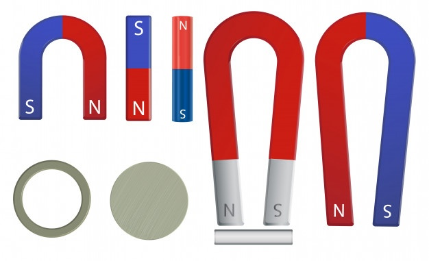

*Image Copyright [brgfx](https://www.freepik.com/free-vector/magnet-set_2480989.htm)*

Permanent magnets look like these!

 

Inside every motor there is a permanent magnet and there is an electromagnet. 

What happens when you point the North end of a magnet to the South end of a magnet?

They try to get away from each other of course! Their electromagnetic fields interact with each other, generating a force. This force is what we use to make the motor turn! We can observe this phenomenon in the animation in this link: [DC Motor animation](https://nationalmaglab.org/education/magnet-academy/watch-play/interactive/dc-motor)

Open it and let the applet load. It should look like this:

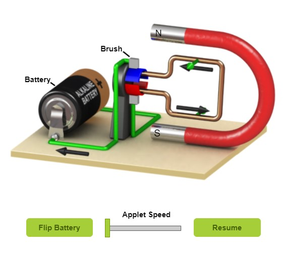

Have a play with the speed and pay attention to the little green arrows. They show the direction in which the electromagnetic force pushes the coil. In this animation, the outer magnet is the permanent magnet, and the coil in the middle connected to the battery is the electromagnet. The part that moves is connected to the **shaft** of the motor, which you can attach things to that need to be moved. All electric motors use this principle.

Now let's take a look at the motors we have right now and learn more about them!

 
 

# Let's play with some motors!
---

## The Servomotor
 

The servomotor you have with you is a very common hobby servomotor, sometimes shortened to 'servo'. It has a permanent magnet and an electromagnet inside arranged like the animation we looked at before, and a gearbox. The gearbox helps to increase the torque (the turning force) of the motor, while slowing down its speed. It also has a sensor that can measure its rotation!

Being able to measure how much it has rotated helps it to decide how much to continue moving, which is nice because it means you don't have to add extra things to control the motor and make it go to the position you want. This can be useful for robotic applications. It is also very light and compact.

Take it out of the bag and let's have a look at the motor.
 

<!-- image of servomotor parts-->
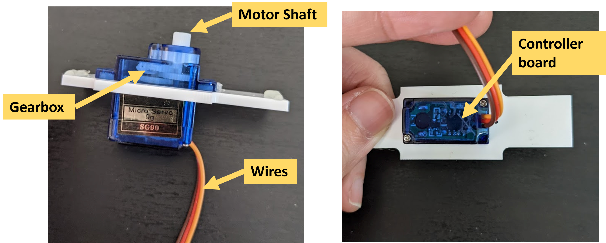 

 
You can see the shaft of the motor on the outside, and through the plastic body you can see the plastic gears inside. At the bottom of the motor, you can see a controller board and there are three wires coming out of the body of the motor.

The brown wire is connected to the ground of the power supply, the red wire is connected to the positive end of the power supply, and the yellow wire will be used to give the control signal to the servomotor. The control signal is what we will give to the motor controller board to tell it what position we want the servomotor to go to.

For servomotors, the control signal is just how long you turn on the current in one second. This is called *Pulse Width Modulation*. The signal would look like this:

 
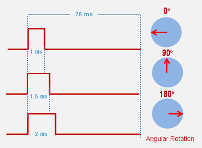

*Image copyright [Apoorve](https://circuitdigest.com/article/servo-motor-working-and-basics#:~:text=Servo%20motor%20works%20on%20PWM,(potentiometer)%20and%20some%20gears.)*
 

The servomotor we have can go from 0 degrees to 180 degrees. You can get servomotors that can move in bigger angles, or even continuously, like normal motors! For our motor, if the current is turned on for a shorter amount of time, the angular position will be smaller. To get a larger angular position, the current should be turned on for a longer amount of time.

You can easily get motor driver boards to control a servomotor, or control them using a microcontroller board like an Arduino or a microbit. All you need is to be able to provide electrical power to the electromagnetic coil, and a control signal. Today we will be using the microbit and a robotics board!

 
 

<!--Comment: End of markdown-->

<!--Comment: Back to html bootstrap -->

<h2>Activity #1</h2>

 

<!--Comment: End of html bootstrap -->

<!--Comment: Back to markdown -->

### Assembling the servomotor demonstrator

First, we need to assemble our set up. Expand the headings below (click on them) to see each step of the instructions.

<!--Comment: End of markdown-->

<!--Comment: Back to html bootstrap -->

  

    

      <a class="collapsed card-link" data-toggle="collapse" href="#collapseOne">
        Check contents of box
      </a>
    

    

      

      Have a look inside your box, you should find lots of stuff in there! The box contains: 
         
        - 1 microbit  
        - 1 Kitronik robotics board  
        - 2 Stepper motors  
        - 1 Servomotor  
        - 1 Bag labelled 'Assembly parts'  
        - 2 3D printed robot arm links (labelled 1 and 2)  
        - 1 base board (white in color in 4 pieces)  
        - 1 x AA 4 battery holder (connected to the Kitronik Robotics board) 
        - 1 whiteboard marker  
        - 1 screwdriver (looks like a pen)  
        - 2 jumper leads (4 wires each)  
        - 1 usb cable   

        
        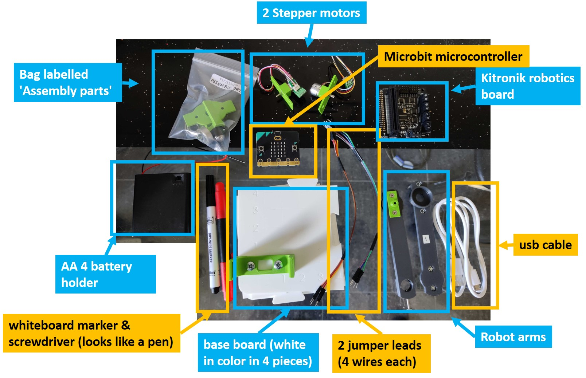

         

        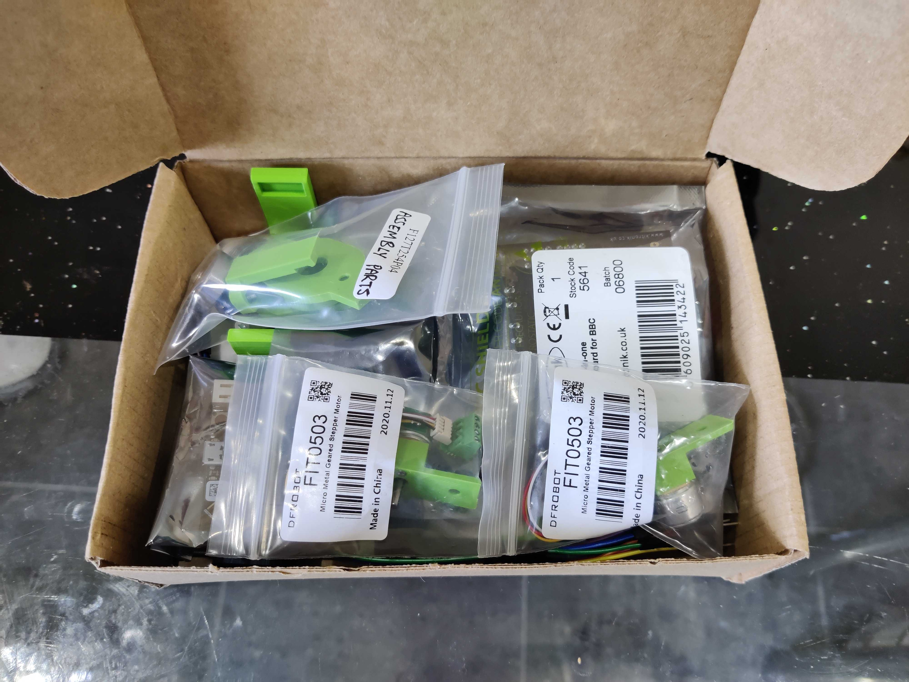

      For this activity, you only need:  
        - the motors that we took out earlier  
        - the part of the base board with the green attachment on it  
        - the 4 AA battery holder and Kitronik Robotics Board  
        - the microbit  
        - the USB cable  
        - the screwdriver  
        - the 3D printed part in the bag labelled 'Motors Workshop'  
        - and Robot Arm 2. 

       
       

      Insert Image
      
      

      Carefully keep the other pieces back in the box for the next workshop.

      

    

  

  

    

      <a class="collapsed card-link" data-toggle="collapse" href="#collapseTwo">
        Assemble the servomotor
      </a>
    

    

      

        Slot the servomotor into the robot arm base on the base board as shown in the photo. It is a snap joint, so all you need to do is put one end of the motor attachment tab into one slot on the motor base, and then gently press in the other end of the motor attachment into the other slot on the motor base until it 'snaps' in.

        Make sure that the shaft of the servomotor is in the middle of the two ends, and is facing up towards the ceiling.

        <a href="./images/assembly1/img4_compressed_annotated.jpg">
        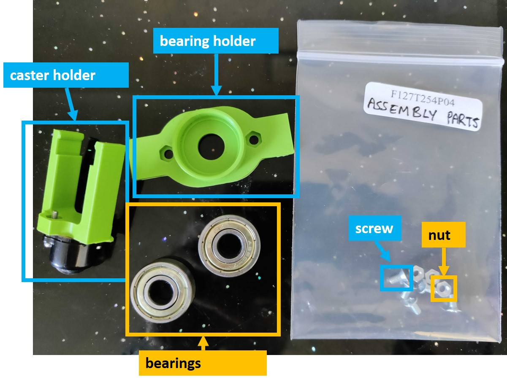
        </a>

      

    

  

  

    

      <a class="collapsed card-link" data-toggle="collapse" href="#collapseThree">
        Connect the motor
      </a>
    

    

      

        Let's take a look at the Kitronik Robotics Board. Check if you have a 'All-In-One' board or a 'Compact' board, it is labelled at the back of the board as shown in the photos:
         
        
         
        

        Depending on your board, the servo pins might look different. If you look at the area circled in the photo below, you will see a set of pins. 

         

        

         

        

        Take the connector of the servomotor and attach it to the first 3 pins (SV1), so that the brown wire goes to GND, the red wire goes to V (or VDD), and the yellow wire goes to SIG. Just press them on straight downwards until the end. Double check your wiring with the photo!

        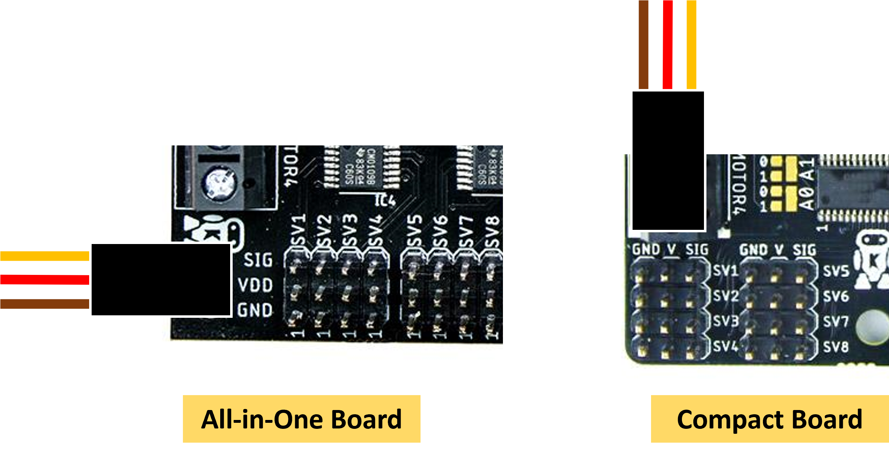

      

    

  

  
  

    

      <a class="collapsed card-link" data-toggle="collapse" href="#collapseFour">
        Install microbit into the Robotics Board
      </a>
    

    

      

        Take the microbit and install it into the Robotics Board. You will need to push down on it fimly to install it into the connector. Make sure it is the right way around. The 'GND' marked on the microbit should be on the same side as the 'GND' on the robotics board. 

        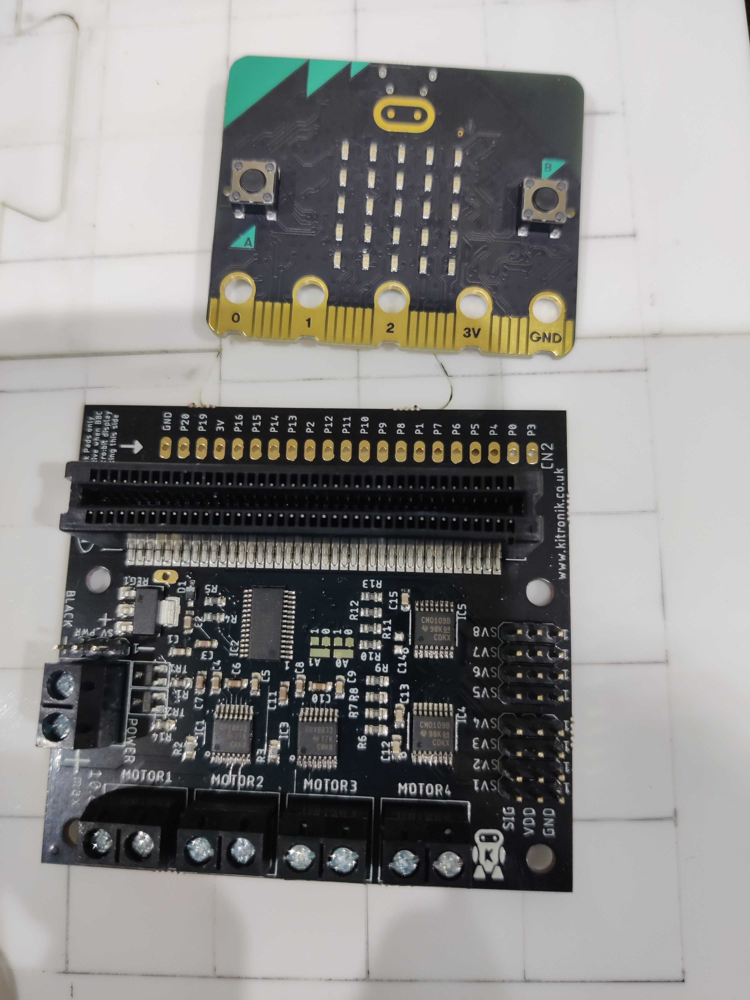
         
        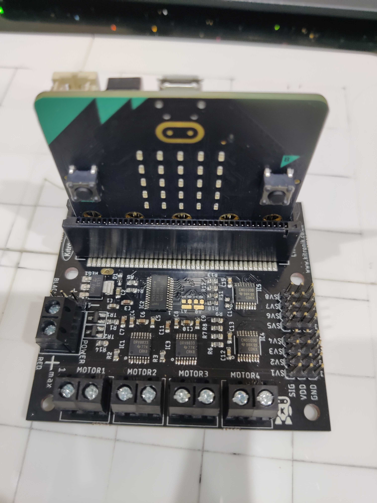

      

    

  

  

    

      <a class="collapsed card-link" data-toggle="collapse" href="#collapseFive">
        Our screwdriver
      </a>
    

    

      

        
Let's take a look at the screwdriver. Take the caps off both ends, you should find different sizes of screwdriver tip. If you give each end a pull you will see that you have four possible sizes of tip. Make sure to select the correct size in this activity. You'll know you've got the right size if it fits snugly into the screw!

        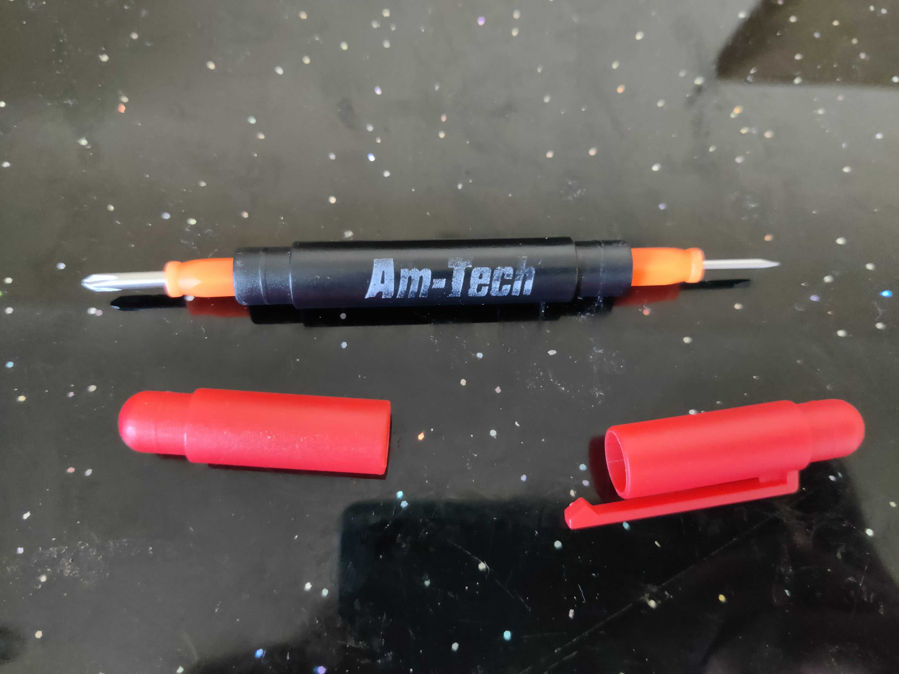
         
        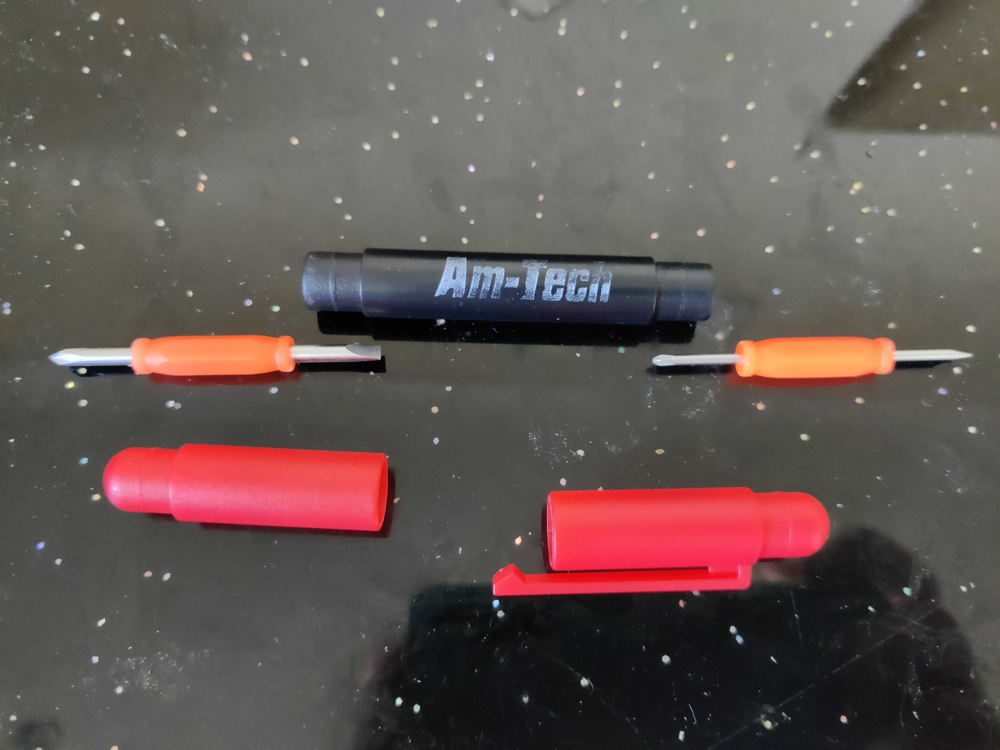

      

    

  

  

    

      <a class="collapsed card-link" data-toggle="collapse" href="#collapseSix">
        Change the attachment on the robot arm
      </a>
    

    

      

        
Take the robot arm labelled number '2', and have a look at the attachment on its end. Use your screwdriver to unscrew the screws and take off the attachment. Be careful not to lose the screws!

        Insert image

        
Take the bag labelled 'Motors Workshop' and take out the shaft attachment inside. Attach it to Robot Arm 2 using the same screws. Remember, righty tighty, lefty loosey!

        
Have a closer look at the attachment on the robot arm. Then take a look at the shaft on the motor. Why do you think the attachment has been designed that way? Can you think of other shapes you can use for a shaft that looks like this?

        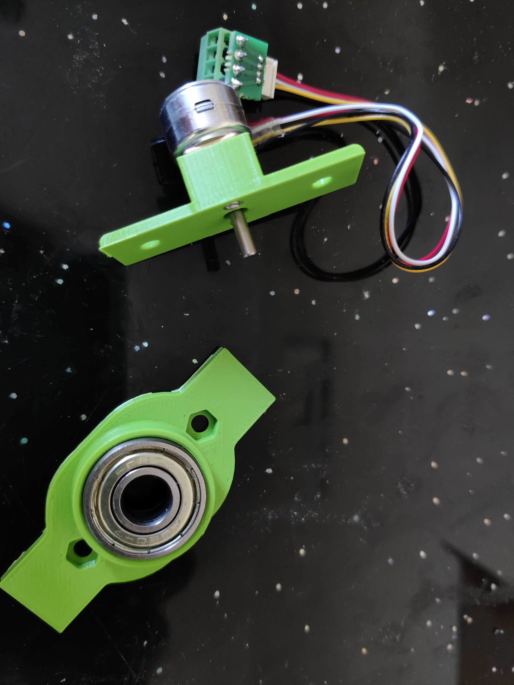

      

    

  

  

    

      <a class="collapsed card-link" data-toggle="collapse" href="#collapseSeven">
        Attach the robot arm
      </a>
    

    

      

        
Make sure the battery holder is switched off. If it is on, the servomotor will try to stay in place and you might break something if you try to force it! The motor also moves very quickly, and you might hurt yourself if it is moving. So keep the battery holder off if you're going to use your hands.

        
Take the robot arm and push it onto the shaft of the servomotor firmly, as shown in the photo. Try and move it, gently. It should be able to move, up to a certain point. Don't force it, or you might break the gears!

        
Push the arm so that it points straight ahead.

        
Once you're done with that, we're ready to start programming!

        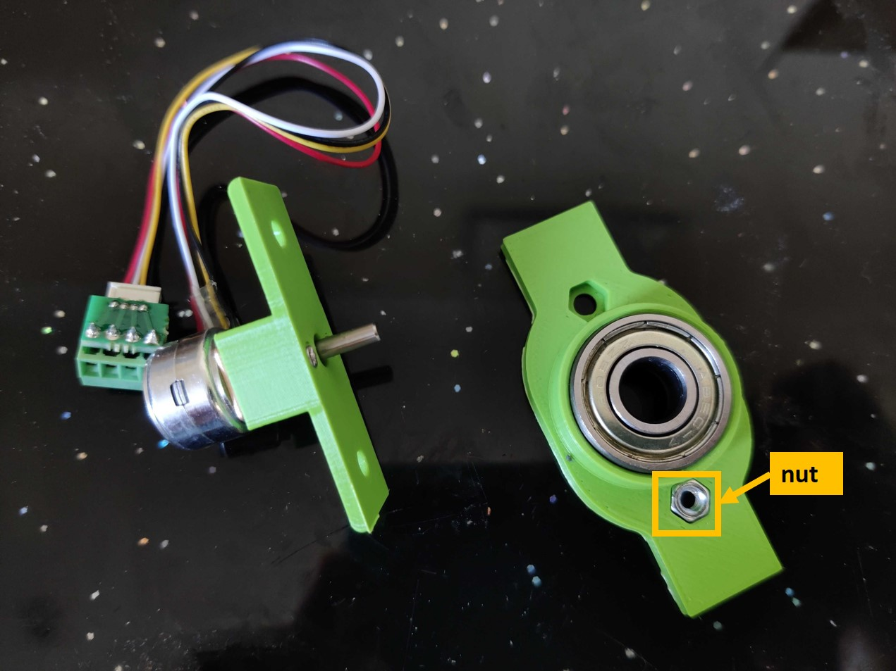

      

    

  

<!--Comment: This section is markdown again-->

  

<!--Comment: End of markdown-->

<!--Comment: Back to html bootstrap -->

<h2>Activity #2</h2>

### Programming the Servomotor

 

<!--Comment: End of html bootstrap -->

<!--Comment: Back to markdown -->

Now we've got our servomotor set up, we can start figuring out how to move it!

<!--Comment: End of markdown-->

<!--Comment: Back to html bootstrap -->

  
  

    

      <a class="collapsed card-link" data-toggle="collapse" href="#collapseOneB">
        Connect the microbit usb cable to your computer
      </a>
    

    

      

        Connect the micro-usb cable between your computer and the microbit. It plugs into the top of the microbit and into the usb port on your computer. When it's connected a red light should come on the microbit, and a yellow light will start flashing.
          
        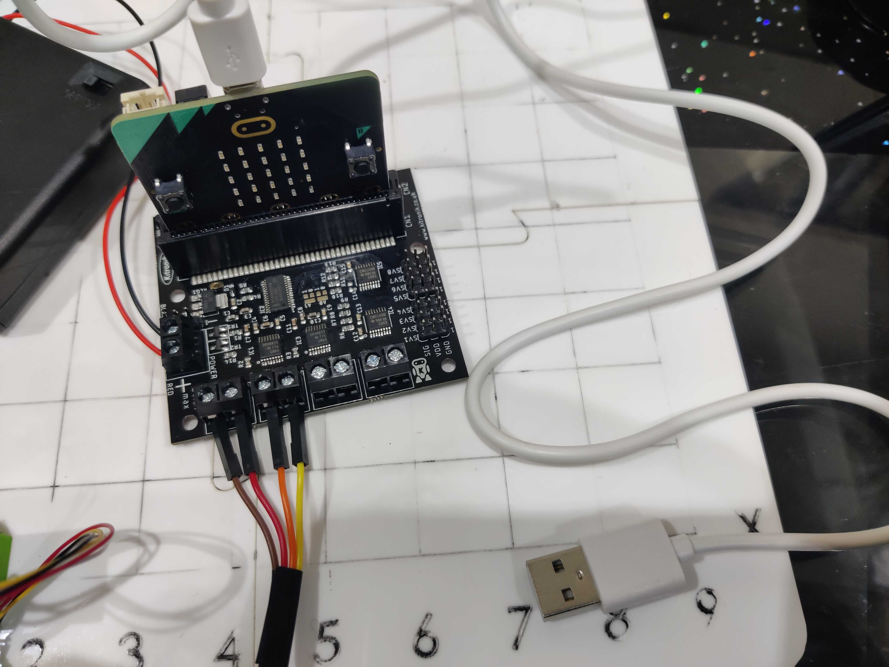
           
        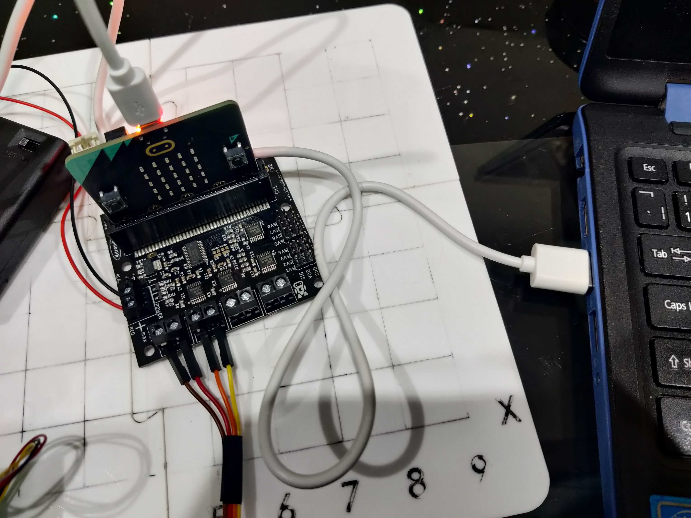

      

    

  

  

    

      <a class="collapsed card-link" data-toggle="collapse" href="#collapseTwoB">
        Check your microbit is working! - write some code
      </a>
    
 
    <!--!!!!!!!!!!!!change the link-->
    

      

        In your browser open a new tab and navigate to the online python editor for microbit: <a href="https://python.microbit.org/" target="_blank">Link here</a>

          

        First of all let's test the microbit is working. Enter the following code into the python   

         

         
        You can transfer this code into your python either by typing it in, or by copying and pasting. Please be careful to make sure you enter it exactly the same! Where you put spaces, tabs, brackets, full stops and other punctuation is really important in python because these characters tell the computer how to understand your code!

      

    

  

  

    

      <a class="collapsed card-link" data-toggle="collapse" href="#collapseThreeB">
        Download the test code to your microbit
      </a>
    

    

      

        Download the code and transfer it to your microbit by clicking on 'Connect', selecting your microbit device, and then clicking 'Flash'.
          
        If you've got any problems with this you can follow this guide to resolve them: <a href="https://python-editor-2-1-2.microbit.org/help.html?snippets=true" target="_blank">Link here</a>
        
          

        You should see your microbit display light up and the code run! Observe what happens on the microbit display.   
        <ul>
        <li>Can you change the text to your name? </li>
        <li>Can you change the image to another type? (Tip: look at this <a href="https://microbit-micropython.readthedocs.io/en/v1.0.1/tutorials/images.html" target="_blank">link</a>) </li>
        </ul>
          
        
        If it doesn't work check your code and connections, something is wrong there. And please remember you can always ask for help!

           

      

    

  

  

    

      <a class="collapsed card-link" data-toggle="collapse" href="#collapseFourB">
        Reset the microbit
      </a>
    

    

      

        Now try pressing the reset button on the back of the microbit. This restarts the microbit and the program will restart from the beginning. Remember you can always press this if your microbit stops working or becomes unresponsive!

           

        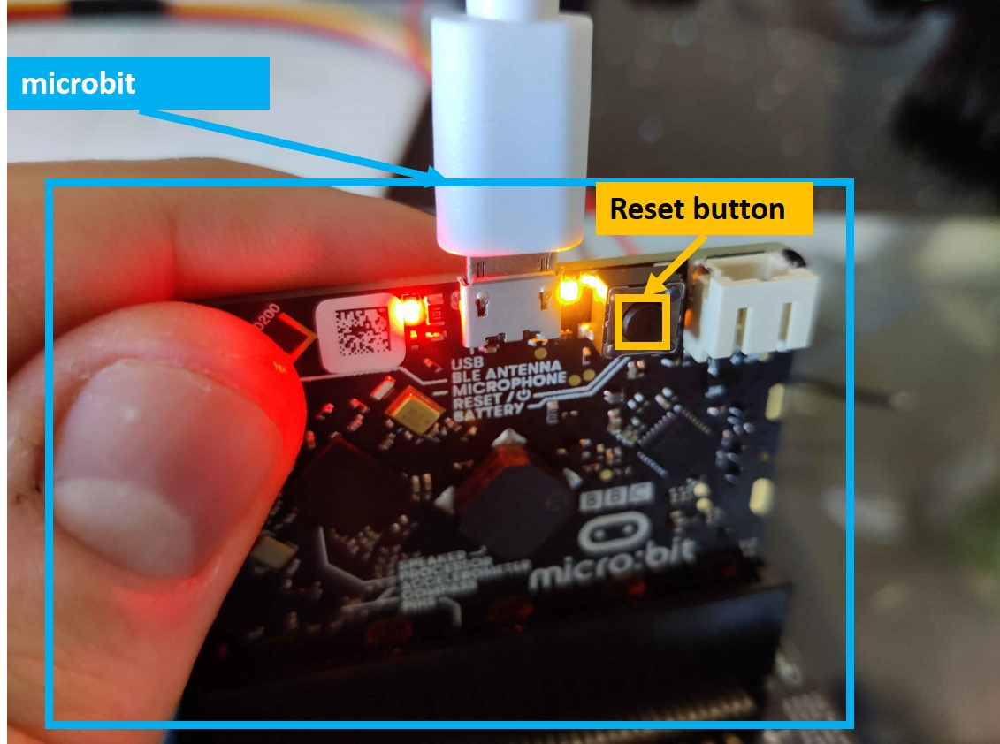

      

    

  

  

    

      <a class="collapsed card-link" data-toggle="collapse" href="#collapseFiveB">
        Turn the power to the motor on
      </a>
    

    

      

        
        
        Turn the small switch on the battery pack to the 'on position'. This will power the motor.

           

        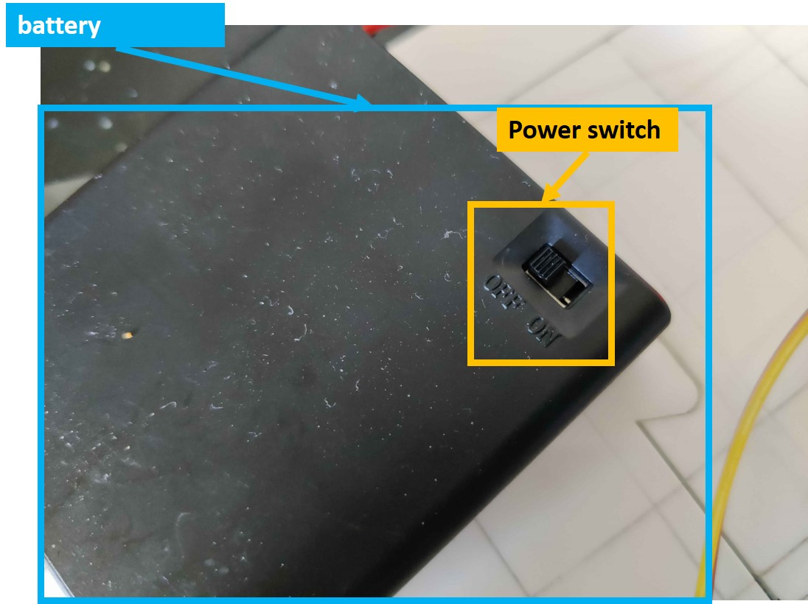

      

    

  

  

    

      <a class="collapsed card-link" data-toggle="collapse" href="#collapseSixB">
        Load our motor code
      </a>
    

    

      

        Next we will load our code to make our motor move!  

        You can download the code we will use from this <a href="./activity_code/servomotor_code.py" download="servomotor_code.py" target="_blank"> link</a>.
        
          

        This link will download a python file to your computer. <!--Probs gonna just make it have just the functions-->

          
        
        Next, in your python editor click on 'Load' and then select the python file you just downloaded (it's called: servomotor_code.py). The code will load and you will see it on your screen.

           

      

    

  

  

    

      <a class="collapsed card-link" data-toggle="collapse" href="#collapseSevenB">
        Download the motor code to your microbit
      </a>
    

    

      

               
        
        
Download the code and transfer it to your microbit by clicking on 'Connect', selecting your microbit device, and then clicking 'Flash'. If you've got any problems with this you can follow this guide to resolve them: <a href="https://python-editor-2-1-2.microbit.org/help.html?snippets=true" target="_blank">Link here</a>

        
You should see the microbit start up with a picture of a ghost! That's how you know you've got the right code. 

           

      

    

  

  

    

      <a class="collapsed card-link" data-toggle="collapse" href="#collapseEightB">
        Zero the arm
      </a>
    

    

      

       
        
Take off the motor arm from the motor. Press the microbit symbol on the microbit to move the arm to the zero position.

        
Were you able to tell whether the motor moved? It might have made a sound, but it is hard to tell how far the motor moved. This is where the motor arm comes in handy. Push the motor arm back on so it points to the right. So now we know that both the motor and the arm is pointing to zero degrees.

        

          
        <ul>
        <li>If you didn't see the picture of the ghost, something is wrong with the software! -> Check your code!</li>
          
        <li>If your robot arm isn't moving then there maybe something wrong with your connections! -> Check your battery is switched on and check all your wires are in the right order and securely in their connections (give them a gentle tug).</li>
           
        </ul>

        
Turn off the battery pack. Move the arm a bit, you should be able to move the arm. **Keep your hands away**, and then turn on the battery pack again. What happens?

      

    

  

  

    

      <a class="collapsed card-link" data-toggle="collapse" href="#collapseNineB">
        Try and move the robot arm (gently)
      </a>
    

    

      

        
When the robot arm is stationary, try and turn the robot arm (gently) with your hand. You should find that if you do that, it will not want to move, and will keep trying to go back to where it should be! You will hear it complaining a bit. This is a feature of servomotors. As we mentioned earlier, they use a sensor to try and go to a position according to the signal that you give it.
 
        
If you push too hard, things might break so be careful!

           

      

    

  

  

    

      <a class="collapsed card-link" data-toggle="collapse" href="#collapseTenB">
        Let's write some code!
      </a>
    

    

      

        
Let's have a look at the code.

        
All this stuff at the beginning, that's code for setting up the robotics board so our microbit can communicate with it and then use it to send signals to the motors.

        
This bit over here, these are <b>functions</b> that can be used for common commands to the motors. It's a bit complicated, but you can think of it as a set of instructions that you would use very often, so you write a function so you won't have to type up the whole thing over and over again!
 
        
This first bit of code you've been given just sets the motor to zero, which is what we used to zero the arm. I've given you a headstart! Look carefully at the function call that sets the motor to zero, and see if you can make the motor do something else when you press the A button or the B button.

        

        <head>
          <link rel="stylesheet"
                href="https://cdnjs.cloudflare.com/ajax/libs/highlight.js/10.0.3/styles/default.min.css">
          
          
        </head>
        <body>
          <pre><code class="python">
          class KitronikRoboticsBoard:
            PRESCALE_REG = 0xFE
            MODE_1_REG = 0x00
            SRV_REG_BASE = 0x08
            MOT_REG_BASE = 0x28
            REG_OFFSET = 4
            #SERVO_MULTIPLIER = 226
            SERVO_MULTIPLIER = 190
            #SERVO_ZERO_OFFSET = 0x66
            SERVO_ZERO_OFFSET = 0X66
            ANGLE_ZERO_OFFSET = 0

            chipAddress = 0x6C
            initialised = False
            stepInit = False
            stepStage = 0
            stepper1Steps = 200
            stepper2Steps = 200

            def __init(self):
                    
                buf = bytearray(2)

                buf[0] = self.PRESCALE_REG
                buf[1] = 0x85 #50Hz
                i2c.write(self.chipAddress, buf, False)
                
                for blockReg in range(0xFA, 0xFE, 1):
                    buf[0] = blockReg
                    buf[1] = 0x00
                    i2c.write(self.chipAddress, buf, False)

                buf[0] = self.MODE_1_REG
                buf[1] = 0x01
                i2c.write(self.chipAddress, buf, False)
                self.initialised = True

            def servoWrite(self, servo, degrees):
                if self.initialised is False:
                    self.__init(self)
                buf = bytearray(2)
                calcServo = self.SRV_REG_BASE + ((servo - 1) * self.REG_OFFSET) #find the servo number
            </code></pre>
        </body>
        

        
         
      

    

  

  

    

      <a class="collapsed card-link" data-toggle="collapse" href="#collapseElevenB">
        Let's move the motor!
      </a>
    

    

      

        
Try pressing the buttons.

        
  <b>!!! Make sure your hands are far away from the motor arm! !!!</b> 

        
Button A will increase the angle, and button B will decrease the angle. You can see it scrolling across the LEDs. When you reach an angle you're happy with, press the microbit symbol. The motor arm will move very quickly!
 <!--Might change this bit honestly, have to check what code might be better and safer-->
         
        
Turn off the battery pack. Move the arm a bit, you should be able to move the arm. <b>Keep your hands away</b>, and then turn on the battery pack again. What happens?

         
      

    

  

  

    

      <a class="collapsed card-link" data-toggle="collapse" href="#collapseElevenB">
        Understanding the code
      </a>
    

    

      

        Let's take a look at the code together. We don't need to understand all of it, but lets get a feel for how it works! 
         
        <ul>
        <li>How can you get the motor to move further when you push the A or B button?</li>
        <li>How do you get the microbit to display a different picture when it starts up?</li>
        <li>What do you think this bit of code is for:  </li>
        <li>What types of robots do you think this motor would be good for? What sort of actions?</li>
        </ul>
      

    

  

  

<!--Comment: This section is markdown again-->

## The Stepper Motor 
 

Now that we've looked at a servomotor, what it looks like, how you connect it and how you make it move, let's do the same for the stepper motor. The stepper motor we've given you in the kit is a miniature unipolar stepper motor. Just like the servomotor, it has a permanent magnet, electromagnets and a gearbox inside. The gearbox for the stepper motor also helps to increase the torque of the motor while reducing how fast it moves. However, the difference is that instead of the electromagnet rotating, the permanent magnet rotates instead! That means the permanent magnet is connected to the shaft.

 

Electromagnet coils are placed around the permanent magnet in the middle, as shown in the figure below. By activating each coil in sequence, the the permanent magnet in the middle will rotate.

 
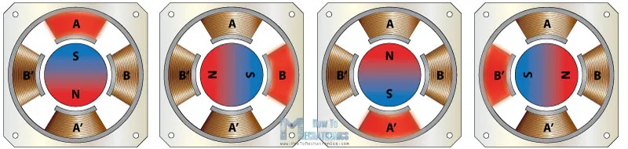

*Image copyright [How To Mechatronics](https://howtomechatronics.com/how-it-works/electrical-engineering/stepper-motor/)*

 

As you can see from the animation, the permanent magnet moves in **steps**, which is why it's called a stepper motor! These types of motors have very good positional control, and are very good at holding their position. You don't really need a sensor in order to make it turn a certain amount, since you can just count the number of steps. But if you control it by moving a certain amount of steps, it won't actually know where you started! So you need to move it to its starting position before you turn on the motor and control program.

This is in comparison to the servomotor, which knows what position it is at even if you turn off the motor, but is slightly worse at holding that position.

Let's take the stepper motor out of its bag and have a look at it.

 

You can see the body of the motor, where the coils and magnet are. The shaft of the motor sticks out from the 3D printed attachment, and the attachment is covering the gearbox. This is so that dirt won't get in, which can mess with how it moves! There are four wires coming out from the body of the motor. These connect to the electromagnet coils.

Now that we know a bit about our stepper motor, let's try and make it move!

<!--Comment: End of markdown-->

<!--Comment: Back to html bootstrap -->

<h2>Activity #3</h2>

 

<!--Comment: End of html bootstrap -->

<!--Comment: Back to markdown -->

### Let's assemble the stepper motor demonstrator!

<!--Comment: End of markdown-->

<!--Comment: Back to html bootstrap -->

  

    

      <a class="collapsed card-link" data-toggle="collapse" href="#collapseOneC">
        Taking off the servomotor
      </a>
    

    

      

      
Turn off the battery before you disassemble the robot.

      
Take off the robot arm from the motor. Unplug the servomotor from the robotics board, and gently pry it out of the motor base. You can then put it back into its plastic bag.

         
      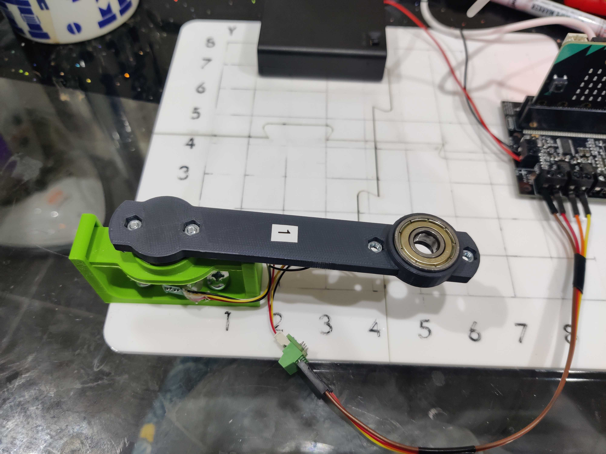

      

    

  

 

    

      <a class="collapsed card-link" data-toggle="collapse" href="#collapseTwoC">
        Take out the parts needed
      </a>
    

    

      

        
Take out the bag labelled "Assembly Parts". Take out the green bearing holder, a bearing, and two screws and two nuts.
 
         
        
         
      

    

  

  

    

      <a class="collapsed card-link" data-toggle="collapse" href="#collapseThreeC">
        Begin to attach the stepper motor!
      </a>
    

    

      

        Take the motor. We're going to attach it to the green bearing holder. Take an M3 nut and place it in one of the hexagonal shaped holes in the bearing holder. 

        

      

    

  

  

    

      <a class="collapsed card-link" data-toggle="collapse" href="#collapseFourC">
        Continue to attach the first motor!
      </a>
    

    

      

        Next take an M3 screw. Line the holes up between the green bearing holder and the motor. Insert the screw into the same hole that your nut is resting in, then use the right sized screwdriver attachment to tighten the screw. You may need to hold the nut in place with your finger. You need to turn it clockwise to tighten it! A good way to remember this is the phrase "righty tighty, lefty loosy".

        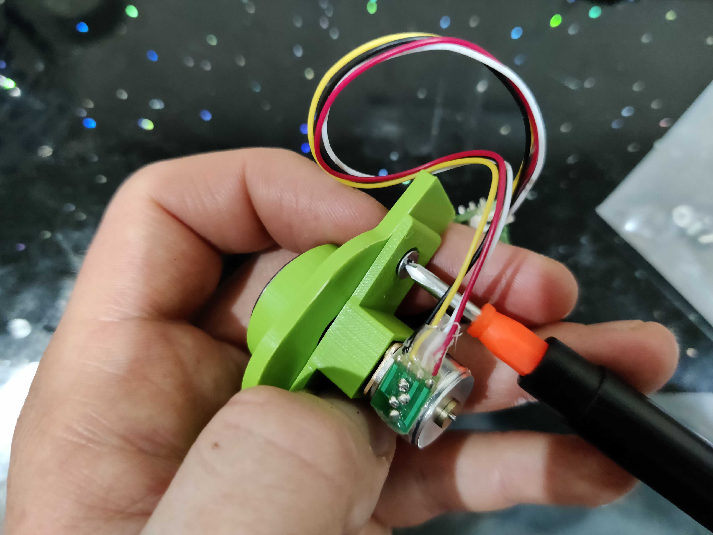

      

    

  

  

    

      <a class="collapsed card-link" data-toggle="collapse" href="#collapseFiveC">
        Finish attaching the first motor
      </a>
    

    

      

        
Repeat this for the second hole between the green bearing holder and the motor. Take another nut, insert it into the hexagonal shaped hole, and then use a screw to tighten the two parts together.

        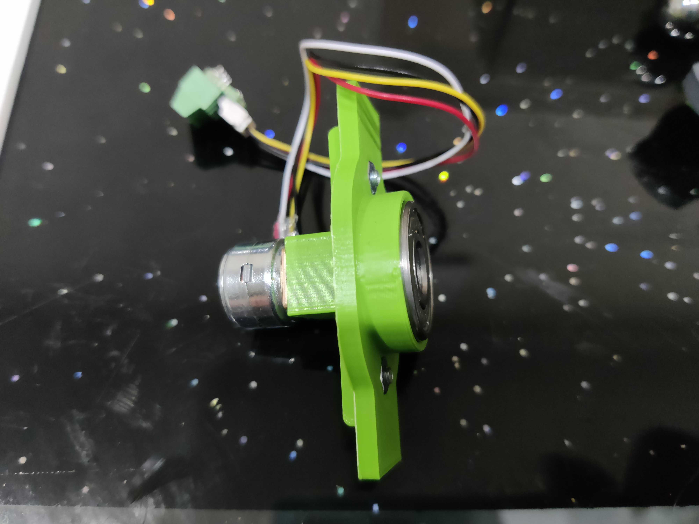
      

    

  

  

    

      <a class="collapsed card-link" data-toggle="collapse" href="#collapseSixC">
        Finish the robot arm base
      </a>
    

    

      

        Clip the motor into the robot arm base. Make sure the wires of the motor are pointing towards you. You will have to gently bend the side of the base so that it snaps in! Well done! You have finished the installation of our base motor! :)

        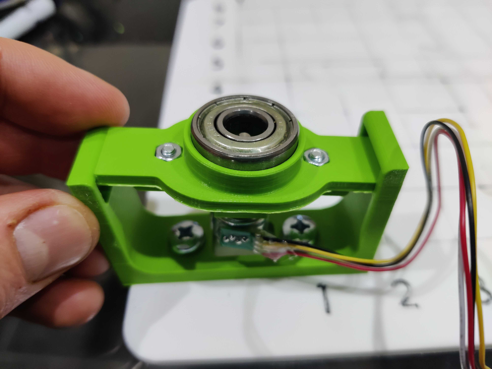
         
        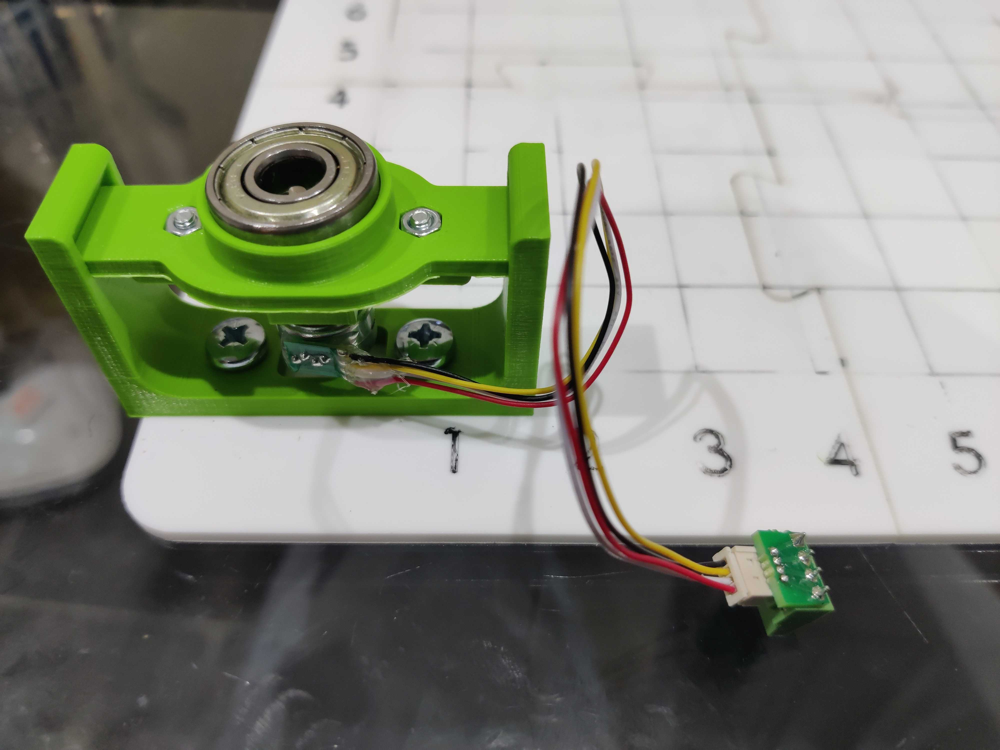

      

    

  

  

    

      <a class="collapsed card-link" data-toggle="collapse" href="#collapseSevenC">
        Attach wires to the robot arm base motor
      </a>
    

    

      

        Take one set of the jumper wires. Take the small screwdriver and gently screw these into the motor connector. Make sure that the wires aren't crossed over! They don't need to be screwed hard, just gently so that if you give them a little tug they can't pull out. Remember righty tighty, lefty loosy!

        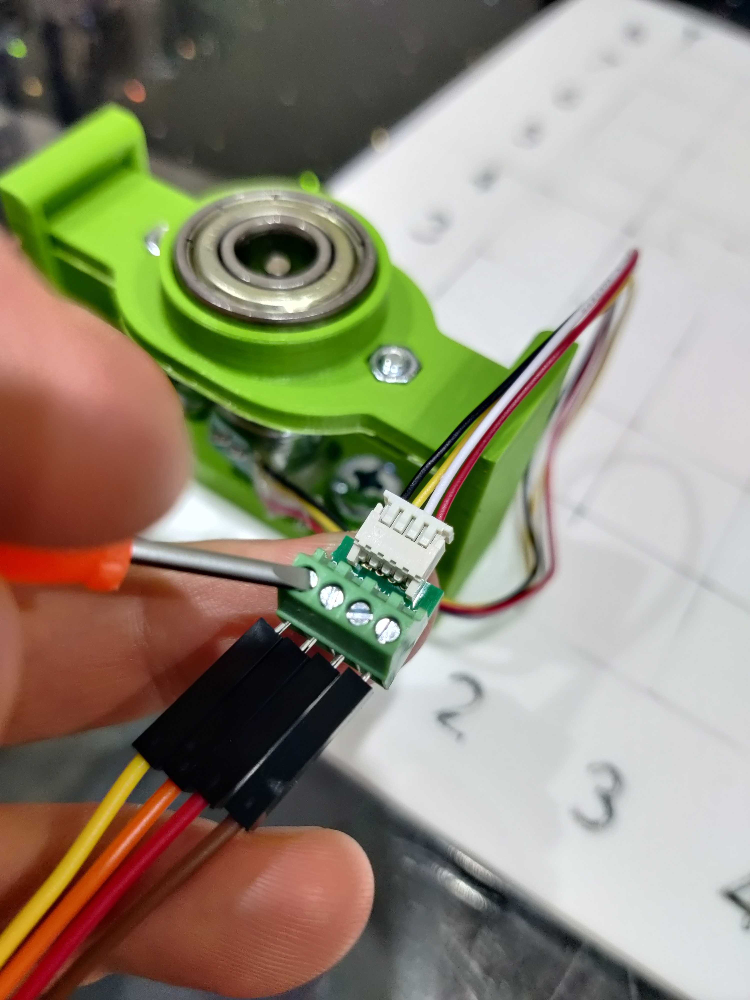

      

    

  

  

    

      <a class="collapsed card-link" data-toggle="collapse" href="#collapseEightC">
        Connect the wires from the motor to the Robotics Board.
      </a>
    

    

      

        
The wires connect into the Robotics board in the same order they came from the motor. Attach them gently with the big screwdriver attachment.

         
        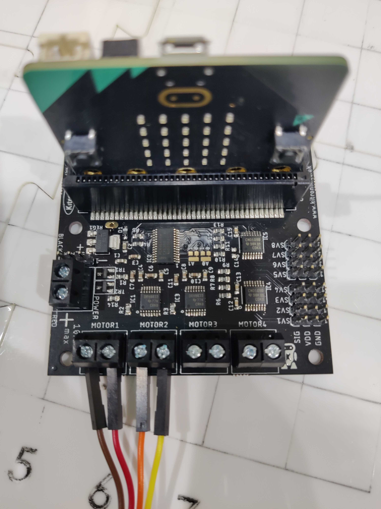
         
        
The motor connector ports should line up with the Robotics board ports as shown in the figure. Make sure there aren't any crossovers in the wires! That means the same colour wire in port 1 on the motor connector on the left should be the same colour wire on port a on the Robotics board on the right.

         
        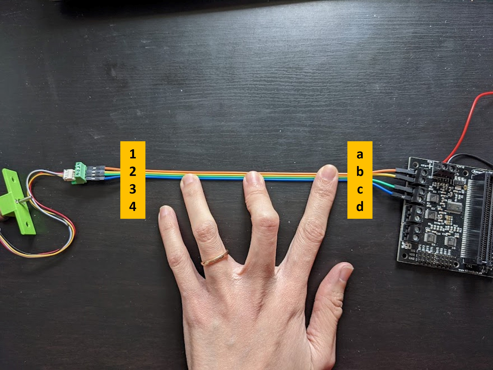
         
      

    

  

 
 

<!--Comment: End of markdown-->

<!--Comment: Back to html bootstrap -->

<h2>Activity #4</h2>

<!--Comment: End of html bootstrap -->

<!--Comment: Back to markdown -->

 

### Programming our Stepper Motor
 

<!--Comment: End of markdown-->

<!--Comment: Back to html bootstrap -->

  

    

      <a class="collapsed card-link" data-toggle="collapse" href="#collapseOneD">
        Your current progress
      </a>
    

    

      

      For the next stage of building the battery should be turned on so do that now.
        
      Your current progress on building the arm should look something like the picture - if not have a check of the previous steps or let a mentor know.  
         
      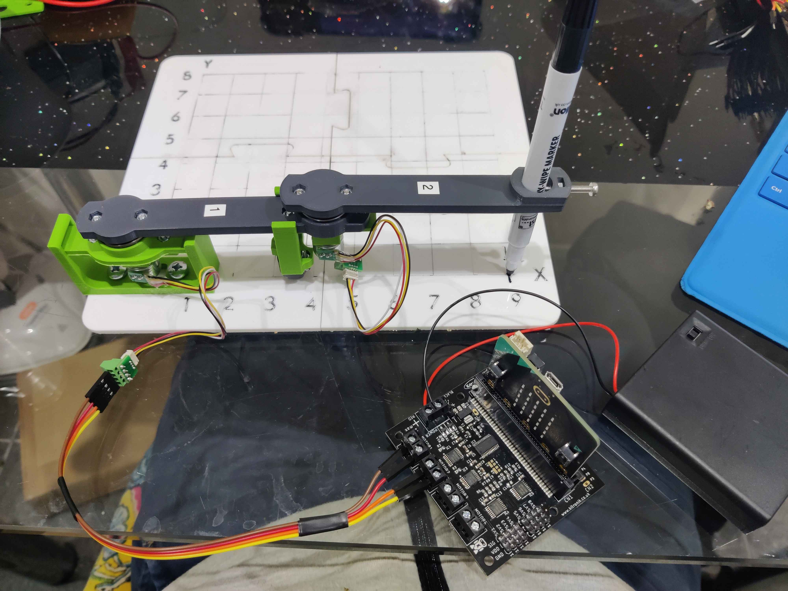

      

    

  

  

    

      <a class="collapsed card-link" data-toggle="collapse" href="#collapseTwoD">
        Check motor code
      </a>
    

    

      

        Check that the motor code is still loaded on the microbit. You can do this by pressing the reset button on the microbit. When the board is reset you should see a picture of a snake for 2 seconds! If you can see this then you can skip this step and move to the next one. If you don't see this then follow the instructions below:

        You can download the code we will use from this <a href="./activity_code/main_rotation.py" download="main_rotation.py" target="_blank"> link</a>.

        It will download a python file to your computer. In your python editor click on 'Load' and then select the python file you just downloaded (it's called: main_rotation.py). The code will load and you will see it on your screen.

          

        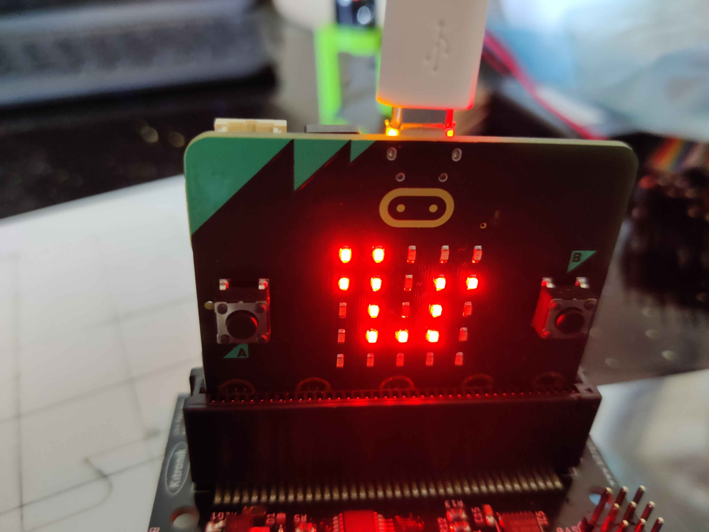

      

    

  

  

    

      <a class="collapsed card-link" data-toggle="collapse" href="#collapseThreeD">
        Switch to controlling motor #2
      </a>
    

    

      

        Press the 'microbit logo' on the microbit to switch between motors. You will get a message 'Motor 2' and the number 2 will appear on the display
          
        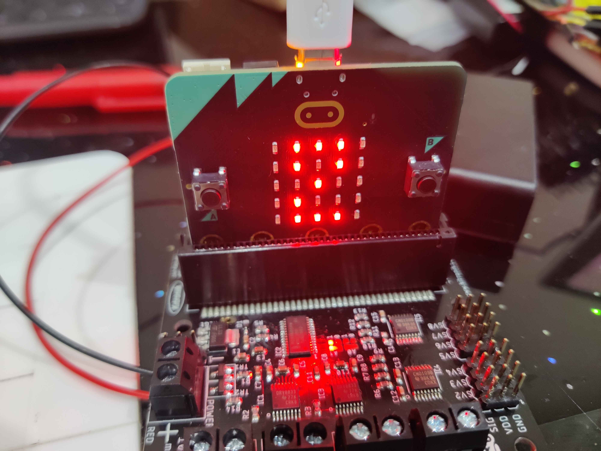

      

    

  

  

    

      <a class="collapsed card-link" data-toggle="collapse" href="#collapseFourD">
        Test the motor rotation
      </a>
    

    

      

        Press the A or B button and then wait to see if the motor rotates, this will move the robot arm link #2. The motor #2 moves anticlockwise (button A) or clockwise (button B) by 15 degrees.

         
        <ul>
        <li>If you didn't see the picture of the snake, something is wrong with the software! -> Check your code!</li>
        <li>If your robot arm isn't moving then there maybe something wrong with your connections! -> Check your battery is switched on and check all your wires are securely in their connections (give them a gentle tug).</li>
        <li>If you accidently press the microbit symbol the code will switch to control motor #1, we don't want this at the moment, so if you do see the number 1 being displayed then just press the microbit symbol on the microbit once to reselect motor #1!</li>
        <li>If your microbit seems unresponsive, then just try to give the reset button a push and see if that helps!</li>
        </ul>
      

    

  

  

    

      <a class="collapsed card-link" data-toggle="collapse" href="#collapseFiveD">
        Our motor is working
      </a>
    

    

      

        Great! Our motor #2 is working, now we can talk about kinematics! and then see it working for real with the robot arm!
      

    

  

  

<!--Comment: This section is markdown again-->

# Let's recap kinematics!
---

<!--Comment: End of markdown-->

<!--Comment: Back to html bootstrap -->

 
 

