<!--Comment: Above here is the header, we need this to generate the web page-->

<!--Comment: This section is markdown inside a bootstrap container-->

A project activity for [Girls Into Coding](https://www.girlsintocoding.com/).

This session is designed to be fun! The idea is that we can follow it together online, but that we can be free to move at our own pace. We're going to be doing some basic python programming in this activity. If you're not too familiar with Python, don't worry, you'll be able to follow along :) ! 

<!--Comment: End of markdown section-->

<!--Comment: This code here is html-->

<!--Comment: This is html paragraph spacing  -->
 
 

<!--Comment: This is html bootstrap-->

<h2>Contents</h2>
<ul class="list-group">
  <li class="list-group-item"><a href="#resourcesPanel">Resources</a></li>
  <li class="list-group-item"><a href="#Explanation">How a Motor works</a></li>
  <li class="list-group-item"><a href="#Activity1">Assembling the servomotor</a></li>
  <li class="list-group-item"><a href="#Activity2">Programming the servomotor</a></li>
  <li class="list-group-item"><a href="#Activity3">Assembling the stepper motor</a></li>
  <li class="list-group-item"><a href="#Activity4">Programming the stepper motor</a></li>
</ul>

<h2>Resources</h2> 
  
Here's some resources that may help with the activity

<ul class="list-group">
  <a href="https://www.w3schools.com/python/" target="_blank" class="list-group-item list-group-item-action">Python tutorials at W3 Schools</a>
  <a href="https://www.pythoncheatsheet.org/" target="_blank" class="list-group-item list-group-item-action">Python cheatsheet</a>
  <a href="https://robohub.org/30-women-in-robotics-you-need-to-know-about-2020/" target="_blank" class="list-group-item list-group-item-action">30 women in robotics you need to know about – 2020</a>
</ul>

<!--Comment: This is the end of html bootstrap-->

<!--Comment: Paragrpah spacing-->
 
 

# How do you move a robot arm?

 

Say you'd like to build a robot. And of course, robots have to move, otherwise they can't do much! 

What can you use to move your robot?
Do you have any ideas?
Think about things that move, what makes them move?

 

*Cartoons Copyright of [Irasutoya](https://www.irasutoya.com)*

 

**Motors** are an easy way to get moving! They can be quite affordable and electrical motors can be powered by batteries, which are a convenient power source. In fact, I've just packed some for you in the box!

Have a look at the box, and pull out the bags labelled "Servomotor" and "Stepper Motor".

They look like this:

 
<!--Insert photo-->

*Cartoons Copyright of [Irasutoya](https://www.irasutoya.com)*
 

These are two different types of motors, and we're going to learn all about them today.
 
 

## How do you make battery power turn into movement?
 

Using magnets!

What do you remember about magnets and how they behave? Let's pause a moment to have a think about it.

 

Have an idea? Cool. Let's crack on!

Have you tried making an **electromagnet** using a coil of wire and a battery? Here's a helpful link if you want to try it at home!

[How to make an electromagnet](https://sciencebob.com/make-an-electromagnet/)

If you run an electrical current through a wire (for example, with a battery!), it will generate an **electromagnetic field** around the wire. Making lots of coils magnifies this effect, so we usually make electromagnets using coils. These are magnets that you can turn on and off, or even switch polarities! This is compared to permanent magnets, which you might have seen around.

 

*Image Copyright [brgfx](https://www.freepik.com/free-vector/magnet-set_2480989.htm)*

Permanent magnets look like these!

 

Inside every motor there is a permanent magnet and there is an electromagnet. 

What happens when you point the North end of a magnet to the South end of a magnet?

They try to get away from each other of course! Their electromagnetic fields interact with each other, generating a force. This force is what we use to make the motor turn! We can observe this phenomenon in the animation in this link: [DC Motor animation](https://nationalmaglab.org/education/magnet-academy/watch-play/interactive/dc-motor)

Open it and let the applet load. It should look like this:

Have a play with the speed and pay attention to the little green arrows. They show the direction in which the electromagnetic force pushes the coil. In this animation, the outer magnet is the permanent magnet, and the coil in the middle connected to the battery is the electromagnet. The part that moves is connected to the **shaft** of the motor, which you can attach things to that need to be moved. All electric motors use this principle.

Now let's take a look at the motors we have right now and learn more about them!

 
 

# Let's play with some motors!
---

## The Servomotor
 

The servomotor you have with you is a very common hobby servomotor, sometimes shortened to 'servo'. It has a permanent magnet and an electromagnet inside, and a gearbox. The gearbox helps to increase the torque (the turning force) of the motor, while slowing down its speed. It also has a sensor that can measure its rotation!

Being able to measure how much it has rotated helps it to decide how much to continue moving, which is nice because it means you don't have to add extra things to control the motor and make it go to the position you want, which is useful for robotic applications. It is also very light and compact.

Take it out of the bag and let's have a look at the motor.
 

<!-- image of servomotor parts-->
 

 
You can see the shaft of the motor on the outside, and through the plastic body you can see the plastic gears inside. At the bottom of the motor, you can see a controller board and there are three wires coming out of the body of the motor.

The brown wire is connected to the ground of the power supply, the red wire is connected to the positive end of the power supply, and the yellow wire will be used to give the control signal to the servomotor. The control signal is what we will give to the motor controller board to tell it what position we want the servomotor to go to.

You can easily get motor driver boards to control a servomotor, or control them using a microcontroller board like an Arduino or a microbit. All you need is to be able to provide electrical power to the electromagnetic coil, and a control signal. Today we will be using the microbit and a robotics board!

 
 

<!--Comment: End of markdown-->

<!--Comment: Back to html bootstrap -->

<h2>Activity #1</h2>

 

<!--Comment: End of html bootstrap -->

<!--Comment: Back to markdown -->

### Assembling the servomotor demonstrator

First, we need to assemble our set up. Expand the headings below (click on them) to see each step of the instructions.

<!--Comment: End of markdown-->

<!--Comment: Back to html bootstrap -->

  

    

      <a class="collapsed card-link" data-toggle="collapse" href="#collapseOne">
        Check contents of box
      </a>
    

    

      

      Have a look inside your box, you should find lots of stuff in there! The box contains: 
         
        - 1 microbit  
        - 1 Kitronik robotics board  
        - 2 Stepper motors  
        - 1 Servomotor  
        - 1 Bag labelled 'Assembly parts'  
        - 2 3D printed robot arm links (labelled 1 and 2)  
        - 1 base board (white in color in 4 pieces)  
        - 1 x AA 4 battery holder (connected to the Kitronik Robotics board) 
        - 1 whiteboard marker  
        - 1 screwdriver (looks like a pen)  
        - 2 jumper leads (4 wires each)  
        - 1 usb cable  

        
        

         

        

      For this activity, you only need:  
        - the motors that we took out earlier  
        - the part of the base board with the green attachment on it  
        - the 4 AA battery holder and Kitronik Robotics Board  
        - the microbit  
        - the USB cable  
        - the screwdriver  
        - the 3D printed part in the bag labelled 'Motors Workshop'  
        - and Robot Arm 2. 

       
       

      Insert Image
      
      

      Carefully keep the other pieces back in the box for the next workshop.

      

    

  

  

    

      <a class="collapsed card-link" data-toggle="collapse" href="#collapseTwo">
        Assemble the servomotor
      </a>
    

    

      

        Slot the servomotor into the robot arm base on the base board as shown in the photo. It is a snap joint, so all you need to do is put one end of the motor attachment tab into one slot on the motor base, and then gently press in the other end of the motor attachment into the other slot on the motor base until it 'snaps' in.

        Make sure that the shaft of the servomotor is in the middle of the two ends, and is facing up towards the ceiling.

        

      

    

  

  

    

      <a class="collapsed card-link" data-toggle="collapse" href="#collapseThree">
        Connect the motor
      </a>
    

    

      

        Let's take a look at the Kitronik Robotics Board. Check if you have a 'All-In-One' board or a 'Compact' board, it is labelled at the back of the board as shown in the photos:
         
        
         
        

        Depending on your board, the servo pins might look different. If you look at the area circled in the photo below, you will see a set of pins. 

         

        
         
        

        Take the connector of the servomotor and attach it to the first 3 pins (SV1), so that the brown wire goes to GND, the red wire goes to V (or VDD), and the yellow wire goes to SIG. Just press them on straight downwards until the end. Double check your wiring with the photo!

        

      

    

  

  
  

    

      <a class="collapsed card-link" data-toggle="collapse" href="#collapseFour">
        Install microbit into the Robotics Board
      </a>
    

    

      

        Take the microbit and install it into the Robotics Board. You will need to push down on it fimly to install it into the connector. Make sure it is the right way around. 

        
         
        

      

    

  

  

    

      <a class="collapsed card-link" data-toggle="collapse" href="#collapseFive">
        Our screwdriver
      </a>
    

    

      

        Let's take a look at the screwdriver. Take the caps off both ends, you should find different sizes of screwdriver tip. If you give each end a pull you will see that you have four possible sizes of tip. Make sure to select the correct size in this activity. You'll know you've got the right size if it fits snugly into the screw!

        
         
        

      

    

  

  

    

      <a class="collapsed card-link" data-toggle="collapse" href="#collapseSix">
        Change the attachment on the robot arm
      </a>
    

    

      

        Take the robot arm labelled number '2', and have a look at the attachment on its end. Use your screwdriver to unscrew the screws and take off the attachment. Be careful not to lose the screws!

        Take the bag labelled 'Motors Workshop' and take out the motor attachment inside. Attach it to Robot Arm 2 using the same screws. Remember, righty tighty, lefty loosey!

        

      

    

  

  

    

      <a class="collapsed card-link" data-toggle="collapse" href="#collapseSeven">
        Attach the robot arm
      </a>
    

    

      

        Make sure the battery holder is switched off.

        Take the robot arm and push it onto the shaft of the servomotor firmly, as shown in the photo.

        We then need to make sure that the position of the arm is correct. Gently use the arm to turn it all the way to the right, until it won't move anymore. Don't use too much force! We don't want to break the motor, we just want to move the shaft into position.

        Once the robot arm doesn't move anymore, pull it off, and put the robot arm so that it faces the right. This way, when your arm is at zero position, it should be pointing to the left, as shown in the photo.

        Once you're done with that, we're ready to start programming!

        

      

    

  

<!--Comment: This section is markdown again-->

# Programming the Servomotor

<!--Comment: End of markdown-->

<!--Comment: Back to html bootstrap -->

<h2>Activity #2</h2>

 

<!--Comment: End of html bootstrap -->

<!--Comment: Back to markdown -->

Whenever we're building a robot (or anything) it's really important to test it works in stages! We've just put our first motor together, so now lets test that it works :)! Follow these instructions to check your motor is moving correctly!

<!--Comment: End of markdown-->

<!--Comment: Back to html bootstrap -->

  

    

      <a class="collapsed card-link" data-toggle="collapse" href="#collapseOneB">
        Attach the 1st robot arm onto the motor
      </a>
    

    

      

      It can be really hard to see whether a motor shaft is moving unless we attach something to it. So let's do that now.     Take the robot arm #1 and place it so that the small 'D' shape in the green part of the robot arm lines up with the motor shaft. You should be able to push the two together gently. Now give the robot arm a gentle turn to check it rotates.  
      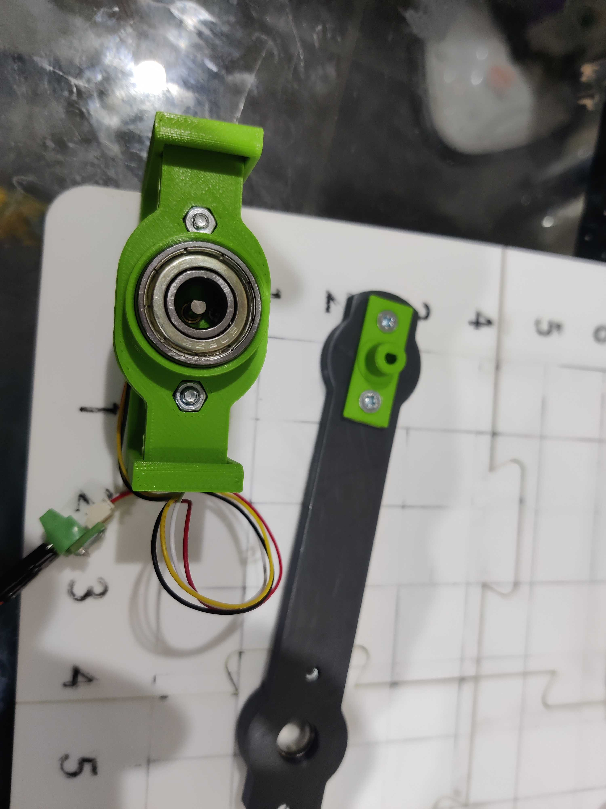
         
      

      

    

  

  

    

      <a class="collapsed card-link" data-toggle="collapse" href="#collapseTwoB">
        Connect the microbit usb cable to your computer
      </a>
    

    

      

        Connect the micro-usb cable between your computer and the microbit. It plug into the top of the microbit and into the usb port on your computer. When it's connected a red light should come on the microbit, and a yellow light will start flashing.
          
        
           
        

      

    

  

  

    

      <a class="collapsed card-link" data-toggle="collapse" href="#collapseThreeB">
        Check your microbit is working! - write some code
      </a>
    

    

      

        In your browser open a new tab and navigate to the online python editor for microbit: <a href="https://python.microbit.org/" target="_blank">Link here</a>

          

        First of all let's test the microbit is working. Enter the following code into the python   

        

         
        You can transfer this code into your python either by typing it in, or by copying and pasting. Please be careful to make sure you enter it exactly the same! Where you put spaces, tabs, brackets, full stops and other punctuation is really important in python because these characters tell the computer how to understand your code!

      

    

  

  

    

      <a class="collapsed card-link" data-toggle="collapse" href="#collapseFourB">
        Download the test code to your microbit
      </a>
    

    

      

        Download the code and transfer it to your microbit by clicking on 'Connect', selecting your microbit device, and then clicking 'Flash'.
          
        If you've got any problems with this you can follow this guide to resolve them: <a href="https://python-editor-2-1-2.microbit.org/help.html?snippets=true" target="_blank">Link here</a>
        
          

        You should see your microbit display light up and the code run! Observe what happens on the microbit display.   
        <ul>
        <li>Can you change the text to your name? </li>
        <li>Can you change the image to another type? (Tip: look at this <a href="https://microbit-micropython.readthedocs.io/en/v1.0.1/tutorials/images.html" target="_blank">link</a>) </li>
        </ul>
          
        
        If it doesn't work check your code and connections, something is wrong there. And please remember you can always ask for help!

           

      

    

  

  

    

      <a class="collapsed card-link" data-toggle="collapse" href="#collapseFiveB">
        Reset the microbit
      </a>
    

    

      

        Now try pressing the reset button on the back of the microbit. This restarts the microbit and the program will restart from the beginning. Remember you can always press this if your microbit stops working or becomes unresponsive!

           

        

      

    

  

  

    

      <a class="collapsed card-link" data-toggle="collapse" href="#collapseSixB">
        Turn the power to the motor on
      </a>
    

    

      

        Turn the small switch on the battery pack to the 'on position'. 

           

        

      

    

  

  

    

      <a class="collapsed card-link" data-toggle="collapse" href="#collapseSevenB">
        Load our motor code
      </a>
    

    

      

        Next we will load our code to make our motors move!  

        You can download the code we will use from this <a href="./activity_code/main_rotation.py" download="main_rotation.py" target="_blank"> link</a>.
        
          

        This link will download a python file to your computer. 

          
        
        Next, in your python editor click on 'Load' and then select the python file you just downloaded (it's called: main_rotation.py). The code will load and you will see it on your screen.

           

      

    

  

  

    

      <a class="collapsed card-link" data-toggle="collapse" href="#collapseEightB">
        Download the motor code to your microbit
      </a>
    

    

      

        Download the code and transfer it to your microbit by clicking on 'Connect', selecting your microbit device, and then clicking 'Flash'. If you've got any problems with this you can follow this guide to resolve them: <a href="https://python-editor-2-1-2.microbit.org/help.html?snippets=true" target="_blank">Link here</a>

           

      

    

  

  

    

      <a class="collapsed card-link" data-toggle="collapse" href="#collapseNineB">
        Test the motor is working
      </a>
    

    

      

        You should see the microbit start up with a picture of a snake! That's how you know you've got the right code. It will then display the motor number which is currently being controlled (number 1). To test the motor press either the A or B button. This will move the motor anticlockwise (A) or clockwise (B) by 15 degrees.

          
        <ul>
        <li>If you didn't see the picture of the snake, something is wrong with the software! -> Check your code!</li>
          
        <li>If your robot arm isn't moving then there maybe something wrong with your connections! -> Check your battery is switched on and check all your wires are securely in their connections (give them a gentle tug).</li>
          
        <li>If you accidentally press the microbit symbol the code will switch to control motor #2, we don't want this at the moment, so if you do see the number 2 being displayed then just press the microbit symbol on the microbit once to reselect motor #1!</li>
        </ul>
           

      

    

  

  

    

      <a class="collapsed card-link" data-toggle="collapse" href="#collapseTenB">
        Try and move the robot arm (gently)
      </a>
    

    

      

        When the robot arm is stationary, try and turn the robot arm (gently) with your hand. You should find that it no longer moves! This is a feature of stepper motors (the type we are using), they keep their position!

           

      

    

  

  

    

      <a class="collapsed card-link" data-toggle="collapse" href="#collapseElevenB">
        Understanding the code
      </a>
    

    

      

        Let's take a look at the code together. We don't need to understand all of it, but lets get a feel for how it works! 
         
        <ul>
        <li>How can you get the motor to move further when you push the A or B button?</li>
        <li>How do you get the microbit to display a different picture when it starts up?</li>
        </ul>
      

    

  

  

    

      <a class="collapsed card-link" data-toggle="collapse" href="#collapseThirteenB">
        Our motor is working!
      </a>
    

    

      

        Great! Our motor is working, now we can assemble the rest of the robot arm!
         
        If you have any problems with any of the previous tasks make sure to tell a mentor so that we can solve them together! :) 

      

    

  

  

<!--Comment: This section is markdown again-->

# Building the second part of our robot arm!
---

<!--Comment: End of markdown-->

<!--Comment: Back to html bootstrap -->

<h2>Activity #3</h2>

 

<!--Comment: End of html bootstrap -->

<!--Comment: Back to markdown -->

Let's build the second part of the robot arm!

<!--Comment: End of markdown-->

<!--Comment: Back to html bootstrap -->

  

    

      <a class="collapsed card-link" data-toggle="collapse" href="#collapseOneC">
        Your current progress
      </a>
    

    

      

      For the next stage of building the battery should be turned off so do that now.
        
      Your current progress on building the arm should look something like the picture - if not have a check of the previous steps or let a mentor know.  
         
      

      

    

  

 

  

    

      <a class="collapsed card-link" data-toggle="collapse" href="#collapseSeven">
        Begin to attach the first motor!
      </a>
    

    

      

        Take the motor. We're going to attach it to the green bearing holder we just put the bearing inside of. Take a single M3 nut out of the 'assembly parts' bag and place it in one of the hexaganol shaped holes in the bearing holder. 

        

      

    

  

  

    

      <a class="collapsed card-link" data-toggle="collapse" href="#collapseEight">
        Continue to attach the first motor!
      </a>
    

    

      

        Next take a single M3 screw out of the 'assembly bag'. Line the holes up between the green bearing holder and the motor. Insert the screw into the same hole that your nut is resting in, then use the right sized screwdriver attachment to tighten the screw. You may need to hold the nut in place with your finger. You need to turn it clockwise to tighten it! A good way to remember this is the phrase "righty tighty, lefty loosy".

        

      

    

  

  

    

      <a class="collapsed card-link" data-toggle="collapse" href="#collapseNine">
        Finish attaching the first motor
      </a>
    

    

      

        Repeat this for the second hole between the green bearing holder and the motor. Take another nut, insert it into the hexaganol shaped hole, and then use a screw to tighten the two parts together.

        

      

    

  

  

    

      <a class="collapsed card-link" data-toggle="collapse" href="#collapseEleven">
        Finish the robot arm base
      </a>
    

    

      

        Clip the motor into the robot arm base. Make sure the wires of the motor are pointing towards you. You will have to gently bend the side of the base so that it snaps in! Well done! You have finished the installation of our base motor! :)

        
         
        

      

    

  

  

    

      <a class="collapsed card-link" data-toggle="collapse" href="#collapseTwelve">
        Attach wires to the robot arm base motor
      </a>
    

    

      

        Take one set of the jumper wires. Take the small screwdriver and gently screw these into the motor connector. Make sure that the wires aren't crossed over! The don't need to be screwed hard, just gently so that if you give them a little tug they can't pull out. Remember righty tighty, lefty loosy!

        

      

    

  

  

    

      <a class="collapsed card-link" data-toggle="collapse" href="#collapseThirteen">
        Install microbit into the Robotics Board
      </a>
    

    

      

        Take the microbit and install it into the Robotics Board. You will need to push down on it fimly to install it into the connector. Make sure it is the right way around. 

        
         
        

      

    

  

  

    

      <a class="collapsed card-link" data-toggle="collapse" href="#collapseFourteen">
        Connect the wires from the motor to the Robotics Board.
      </a>
    

    

      

        The wires connect into the Robotics board in the same order they came from the motor. Attach them gently with the big screwdriver attachment. 
        

        
         

        The motor connector ports should line up with the Robotics board ports as shown in the figure. Make sure there aren't any crossovers in the wires! That means the same colour wire in port 1 on the motor connector on the left should be the same colour wire on port a on the Robotics board on the right.
        

      

    

  

  

    

      <a class="collapsed card-link" data-toggle="collapse" href="#collapseFifteen">
        Connect the battery
      </a>
    

    

      

        Take the large AA battery and connect its two wires to the Robotics Board. This is an important step! Make sure not to get the wires the wrong way around. The red wire goes to the screw terminal labelled 'RED +' and the black wire goes to the screw terminal labelled 'Black -' . Check the small switch on the the battery pack, it should be in the 'off position'. 
         
        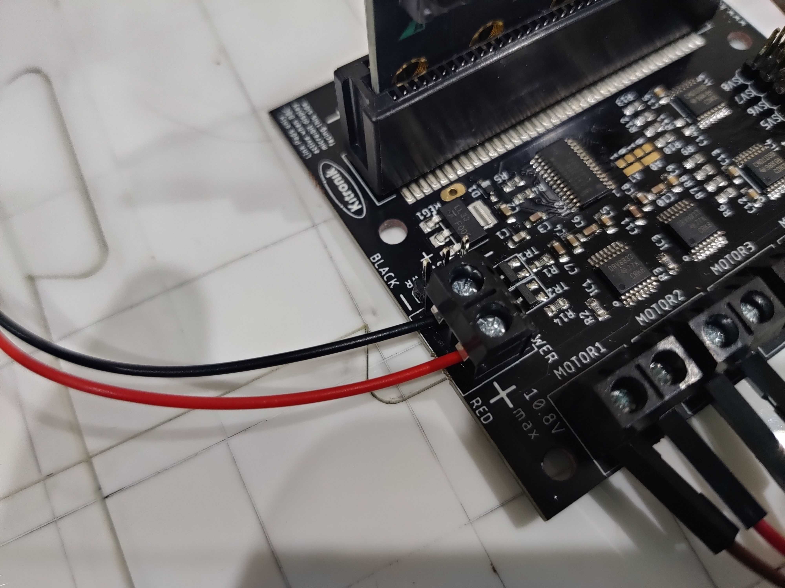
         
        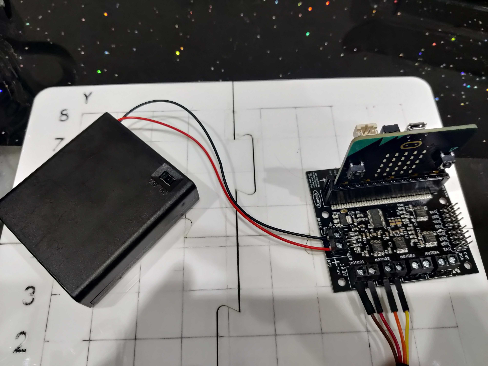
         
        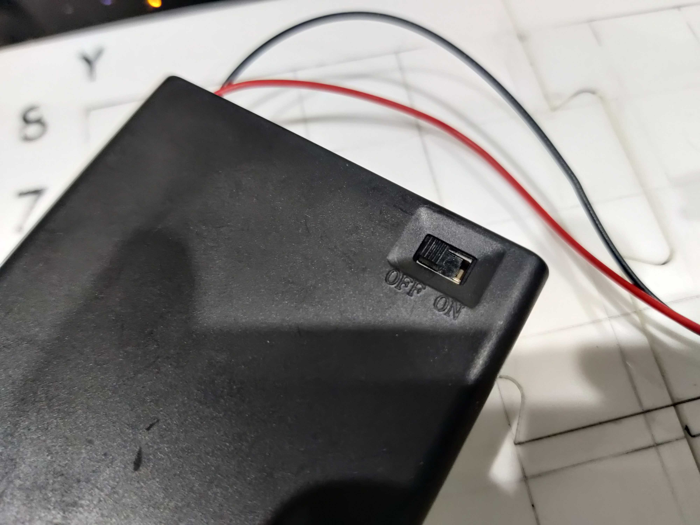

      

    

  

 
 

# Testing the second part of our robot arm!
---

<!--Comment: End of markdown-->

<!--Comment: Back to html bootstrap -->

<h2>Activity #4</h2>

 

<!--Comment: End of html bootstrap -->

<!--Comment: Back to markdown -->

Whenever we're building a robot (or anything) it's really important to test it works in stages! We've just put our second motor together, so now lets test that it works :)! Follow these instructions to test the second motor and link of the robot arm!

<!--Comment: End of markdown-->

<!--Comment: Back to html bootstrap -->

  

    

      <a class="collapsed card-link" data-toggle="collapse" href="#collapseOneD">
        Your current progress
      </a>
    

    

      

      For the next stage of building the battery should be turned on so do that now.
        
      Your current progress on building the arm should look something like the picture - if not have a check of the previous steps or let a mentor know.  
         
      

      

    

  

  

    

      <a class="collapsed card-link" data-toggle="collapse" href="#collapseTwoD">
        Check motor code
      </a>
    

    

      

        Check that the motor code is still loaded on the microbit. You can do this by pressing the reset button on the microbit. When the board is reset you should see a picture of a snake for 2 seconds! If you can see this then you can skip this step and move to the next one. If you don't see this then follow the instructions below:

        You can download the code we will use from this <a href="./activity_code/main_rotation.py" download="main_rotation.py" target="_blank"> link</a>.

        It will download a python file to your computer. In your python editor click on 'Load' and then select the python file you just downloaded (it's called: main_rotation.py). The code will load and you will see it on your screen.

          

        

      

    

  

  

    

      <a class="collapsed card-link" data-toggle="collapse" href="#collapseThreeD">
        Switch to controlling motor #2
      </a>
    

    

      

        Press the 'microbit logo' on the microbit to switch between motors. You will get a message 'Motor 2' and the number 2 will appear on the display
          
        

      

    

  

  

    

      <a class="collapsed card-link" data-toggle="collapse" href="#collapseFourD">
        Test the motor rotation
      </a>
    

    

      

        Press the A or B button and then wait to see if the motor rotates, this will move the robot arm link #2. The motor #2 moves anticlockwise (button A) or clockwise (button B) by 15 degrees.

         
        <ul>
        <li>If you didn't see the picture of the snake, something is wrong with the software! -> Check your code!</li>
        <li>If your robot arm isn't moving then there maybe something wrong with your connections! -> Check your battery is switched on and check all your wires are securely in their connections (give them a gentle tug).</li>
        <li>If you accidently press the microbit symbol the code will switch to control motor #1, we don't want this at the moment, so if you do see the number 1 being displayed then just press the microbit symbol on the microbit once to reselect motor #1!</li>
        <li>If your microbit seems unresponsive, then just try to give the reset button a push and see if that helps!</li>
        </ul>
      

    

  

  

    

      <a class="collapsed card-link" data-toggle="collapse" href="#collapseFiveD">
        Our motor is working
      </a>
    

    

      

        Great! Our motor #2 is working, now we can talk about kinematics! and then see it working for real with the robot arm!
      

    

  

  

<!--Comment: This section is markdown again-->

# Let's recap kinematics!
---

<!--Comment: End of markdown-->

<!--Comment: Back to html bootstrap -->

<h2>Activity #5</h2>

 

<!--Comment: End of html bootstrap -->

<!--Comment: Back to markdown -->

## Joints and Grids

I'm going to introduce some new terms!

When we work with certain robots, we like to talk about the **Joint Space** and the **Cartesian Space**. They're just two ways of describing where our robot is, or its **state**. I'll show you in a bit what these terms mean, but first I'll show you where Forward and Inverse Kinematics fits into all this. I'll come back to this diagram later and you'll understand it better.

 

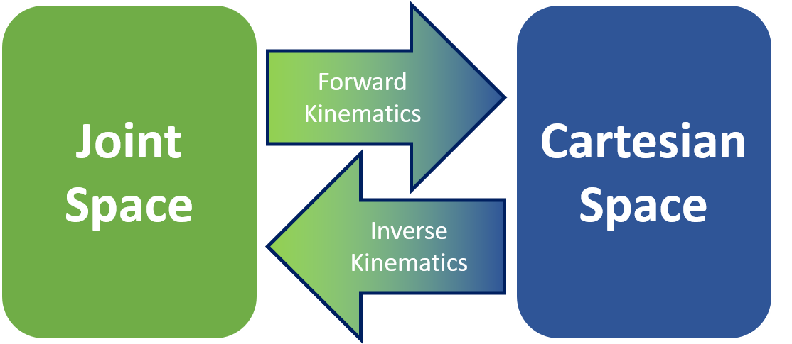

 
 

# Let's try moving in the Joint Space!

 

When we talk about **Joint Space**, we are describing what each joint of the robot is doing. Joints are places where the robot can move, and usually connect two rigid bodies. We use **joints** and **links** to try and simplify the mathematics we need to do.

A good example of this is our own human arm! If I were to make a very simple drawing of how my arm moves, I'd have a shoulder joint, an elbow joint, and a wrist joint. The bones in between are links.

 

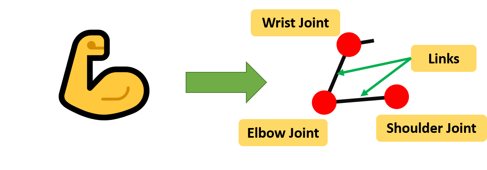

 

If you observe our robot arm, it uses **revolute joints**. These are joints that only rotate, a bit like like the hinges in your room door! 

 

We've made a little animation that you can use to try and understand what it means to control the robot in joint space. 

 

  See the Pen <a href="https://codepen.io/benisme/pen/BapYoKB">
  Robot arm (Joint Angles v1)</a> by Ben (<a href="https://codepen.io/benisme">@benisme</a>)
  on <a href="https://codepen.io">CodePen</a>.

  

Have a play around with it, and see if you can understand what values you can give the joint, and what it will make the joint do!

The picture below might help you understand what the values mean for a more complex robot. The black lines indicate where 'zero' is for that joint, and I've put down the direction that are positive values.

 

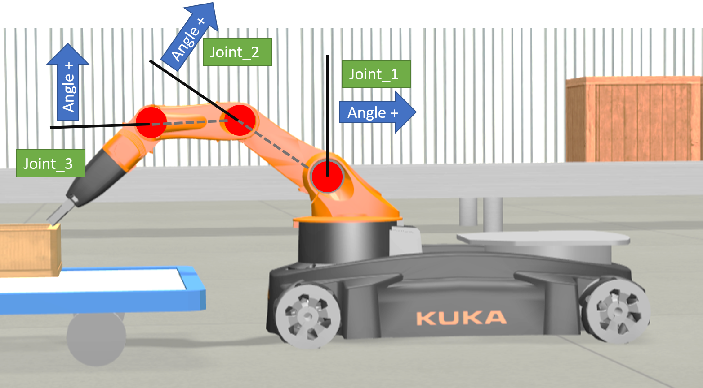 <!-- Have to replace this -->

 

# What about Cartesian Space?

<h2>Activity #6</h2>

 

After playing about with the **Joint Space**, maybe you're getting the hang of it. Now just imagine if you had a robot with *lots more joints*! Like *twenty*. What about robots like these?

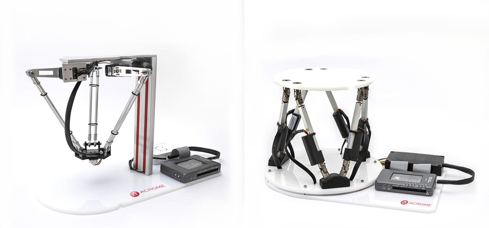
*Images Copyright [Acrome Robotics](https://acrome.net/)*

 

That's a lot of joints you'd have to control! It wouldn't be easy using joint space alone.

Now I'm going to introduce you to **Cartesian Space**. You might have heard of things like **coordinates**. Coordinates are a way of talking about the position of things, and Cartesian is a system of coordinates. If you know maps, you'll have heard of longitude and latitude, it's a bit like that.

The **Cartesian coordinate system** in 2-dimensions (a flat surface!) uses 2 axes: x and y to describe where a point is on that plane. For example, in the image below the cat is at x = 2 and y = 3. Or we can write it as (2, 3) with brackets. So if I told you to put the cat at (2, -3), where would I put it?

 

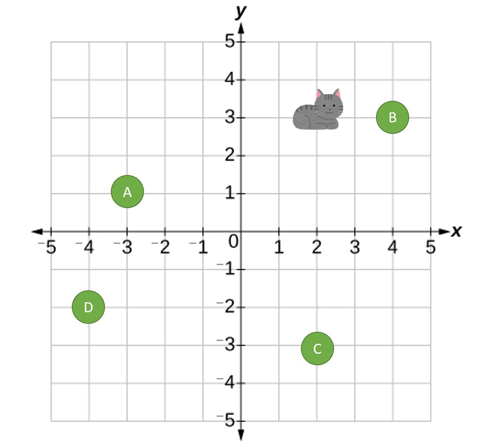
*Cat Image Copyright of [Irasutoya](https://www.irasutoya.com)*

 

Okay, so now you have the idea. Here is an image of the robot and a grid over it, with **x** and **y** axis measurements. Any point within the pink area (also called the workspace) is a place the end of the robot can reach.

 

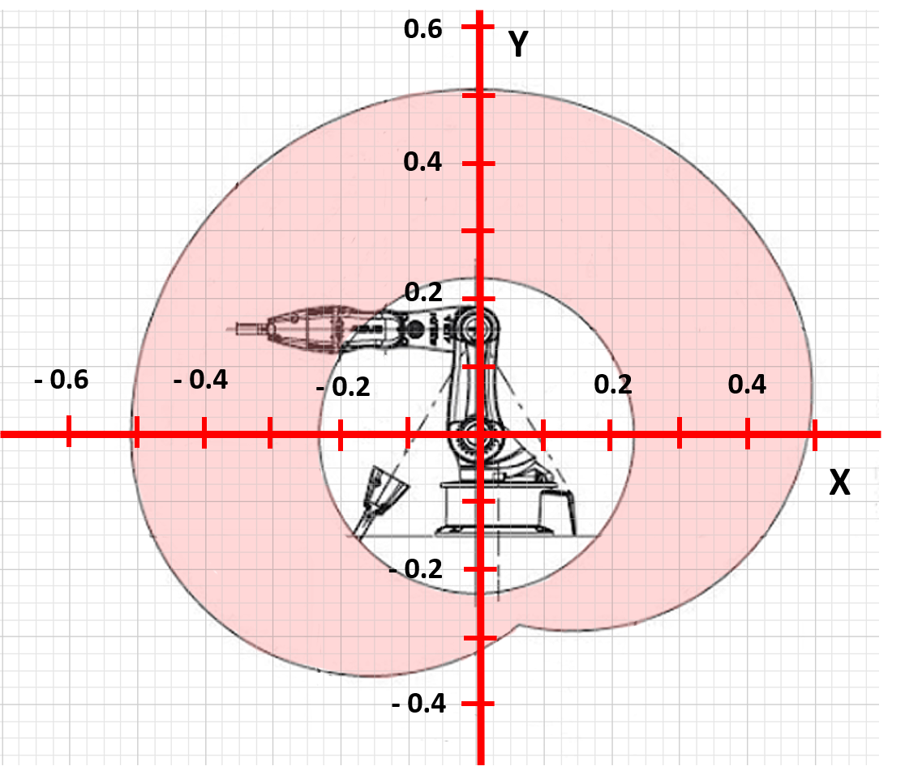

 

This is exactly the same as for our simple robot arm!

 

# Let's move in Cartesian Space!

<h2>Activity #7</h2>

 

In this activity, we're going to try and make the pen touch a flower!

 

<!--Comment: Back to html bootstrap -->

  

    

      <a class="collapsed card-link" data-toggle="collapse" href="#collapseOneE">
        Your current progress
      </a>
    

    

      

      For the next stage of the activity the battery should be turned on so do that now.
        
      The arm should look something like the picture - if not have a check of the previous steps or let a mentor know.  
         
      
       
      

    

  

  

    

      <a class="collapsed card-link" data-toggle="collapse" href="#collapseTwoE">
        Load our cartesian control code
      </a>
    

    

      

        Next we will load our code to make our robot arm move with cartesian control!
         
        You can download the code we will use from this <a href="./activity_code/main_cartesian.py" download="main_cartesian.py" target="_blank"> link</a>.
         
        It will download a python file to your computer. In your python editor click on 'Load' and then select the python file you just downloaded (it's called: main_cartesian.py). The code will load and you will see it on your screen.
      

    

  

  

    

      <a class="collapsed card-link" data-toggle="collapse" href="#collapseThreeE">
        Download the motor code to your microbit
      </a>
    

    

      

        Download the code and transfer it to your microbit by clicking on 'Connect', selecting your microbit device, and then clicking 'Flash'. If you've got any problems with this you can follow this guide to resolve them: https://python-editor-2-1-2.microbit.org/help.html?snippets=true
      

    

  

  

    

      <a class="collapsed card-link" data-toggle="collapse" href="#collapseFourE">
        Test the cartesian code is working
      </a>
    

    

      

        You should see the microbit start up with a picture of a ghost! That's how you know you've got the right code. It will then display the letters XY.
           
        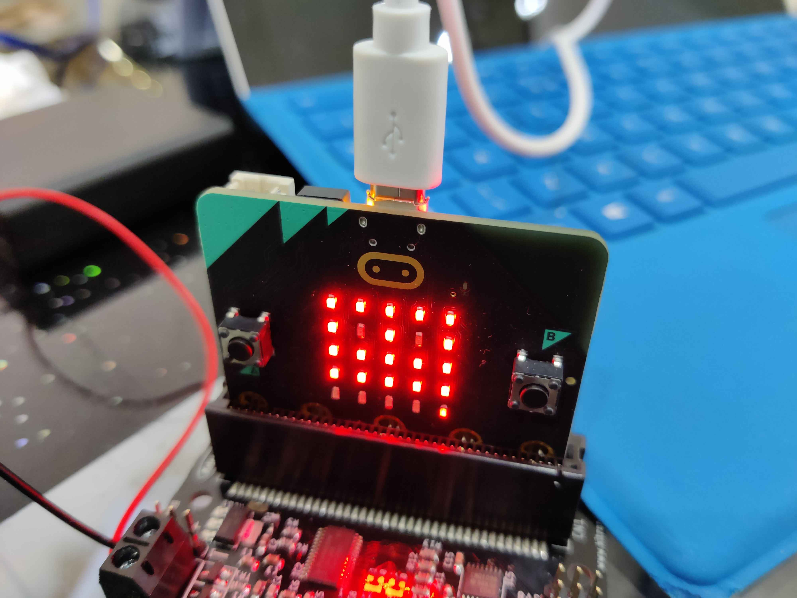
          
        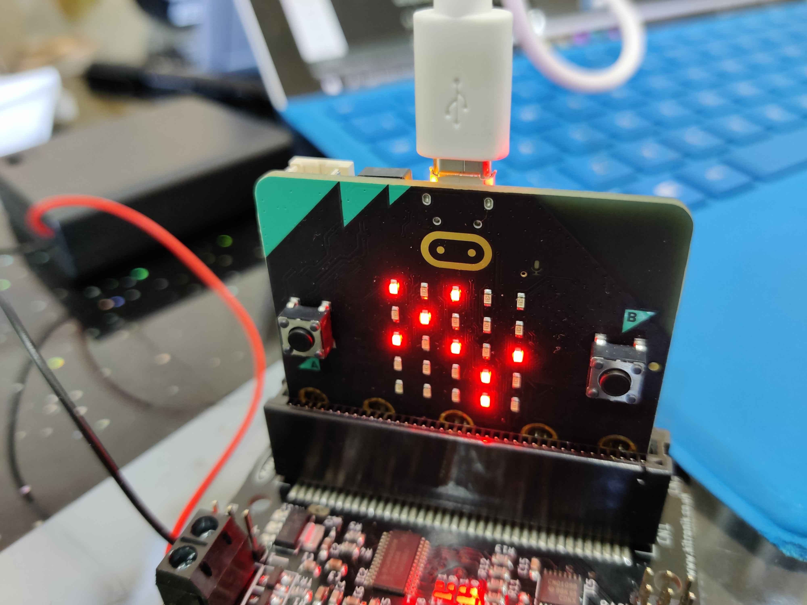
          
        Next touch the microbit logo button, the robot arm should move to the approximate position x = 5, y = 5.
         
        <ul>
        <li>If you didn't see the picture of the ghost, something is wrong with the software! -> Check your code!</li>
        <li>If your robot arm isn't moving then there maybe something wrong with your connections! -> Check your battery is switched on and check all your wires are securely in their connections (give them a gentle tug).</li>
        <li>If you accidently press the a or b button, the code will move the arm to a different position, we don't want this at the moment. So if you do do that just press the resest button on the microbit and try again! :) </li>
        <li>If your microbit seems unresponsive, then just try to give the reset button a push and see if that helps!</li>
        </ul>
      

    

  

  

    

      <a class="collapsed card-link" data-toggle="collapse" href="#collapseFiveE">
        Draw a flower on your actvity board
      </a>
    

    

      

        Draw a flower on you board at the position x = 7, y = 5
          
        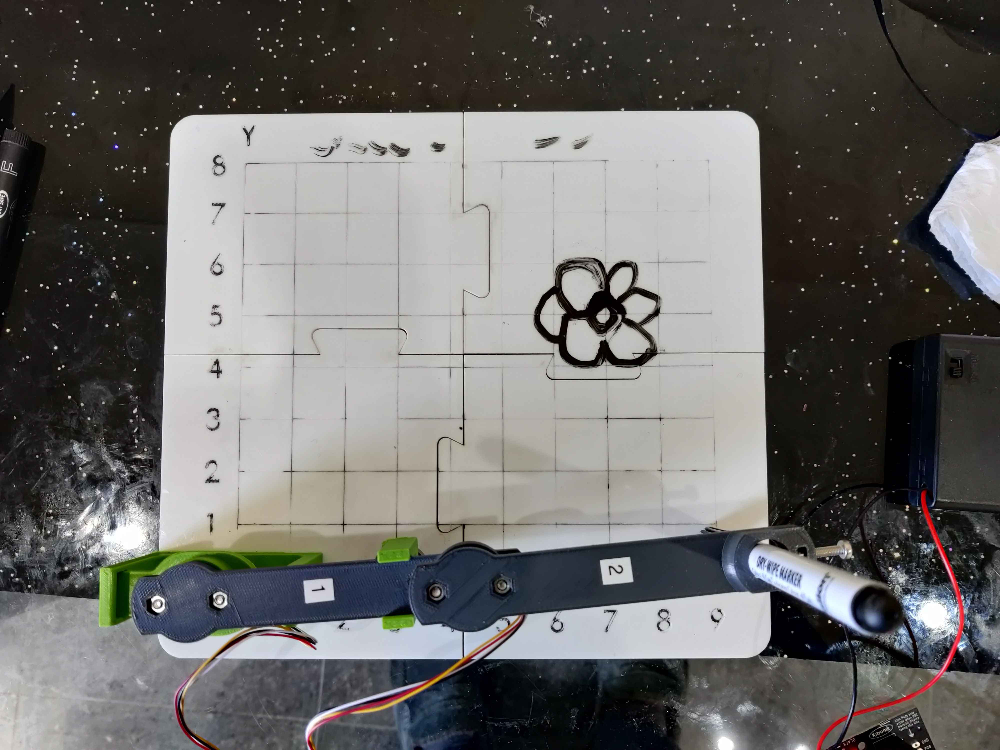
          
      

    

  

  

    

      <a class="collapsed card-link" data-toggle="collapse" href="#collapseSixE">
        Program the microbit to move the robot arm to the flower
      </a>
    

    

      

        We need to program the microbit to move the robot arm to touch the flower
         
        If you touch either the a or b button you will notice that you can input the desired position of the robot arm. The a button increases the y value by 1, and the b button increases the x button by 1.
         
        When you want the robot arm to move to the desired position then you press the microbit logo!
         
        Try and program the robot arm by pressing the buttons (Tip: you need to press the b button), to move to the position x = 7 and y = 5 so that it touches the flower that we've just drawn.
      

    

  

  

    

      <a class="collapsed card-link" data-toggle="collapse" href="#collapseSevenE">
        Experimenting with the robot arm
      </a>
    

    

      

        Try and pick another position near to the flower and get your arm to move there by programming in the grid co-ordinates. Note that our arm is a low cost version and it's performance isn't brilliant! But hopefully you can see it move to the approximate position!! :) .
         
        Sometimes you might get the message on the microbit that the arm can't reach a position. This will happen if you input co-ordinates that are impossible for the arm to reach!! (Because of it's geometry)
      

    

  

  

<!--Comment: This section is markdown again-->

# (Summary) So that chart we had before...

<h2>Activity #8</h2>

 

 

This is why we use kinematics. It can be hard to imagine in our heads what the end of the robot might do if we changed the position of a joint. **Forward Kinematics** can help us change our joint positions to **Cartesian space**, which can be a lot easier to visualise. If we know a point in **Cartesian space** we want to get to, we can use **Inverse Kinematics** to find the joint positions we need to give our robot.

This is a really simplified problem with a robot arm, but we use the same principles when we're trying to figure out where a car is, or even flying robots. We used **trigonometry** and **geometry** to do this. 

What else do you think this might be useful for?

 
 

